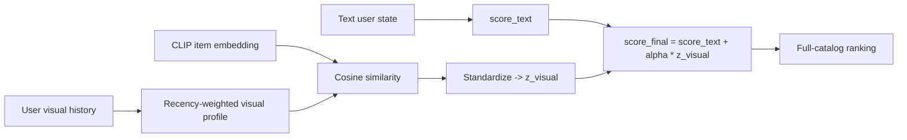
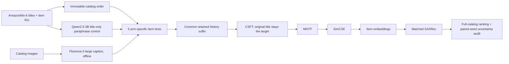

# LLM2Rec-Research: Version-Tracked Multimodal Extensions to LLM2Rec

[](https://www.python.org/)
[](https://pytorch.org/)
[](https://github.com/HappyPointer/LLM2Rec)
[](#version-generations)
[](#citation--license)

> **Independent research fork**
> **Focus:** does aligning LLM2Rec's text-only sequential-recommendation pipeline with visual and collaborative-hardness signals improve ranking, and under what conditions?
> **Upstream:** He et al., *LLM2Rec: Large Language Models Are Powerful Embedding Models for Sequential Recommendation*, KDD 2025 ([HappyPointer/LLM2Rec](https://github.com/HappyPointer/LLM2Rec), pinned commit `73b481f`).

---

## Overview

**LLM2Rec-Research** takes the vanilla LLM2Rec pipeline — CSFT → MNTP → SimCSE → item-embedding table → sequential recommender — and asks one question repeatedly, at a different intervention point each generation: *does adding non-text evidence (image content, or collaborative "hardness") improve recommendation, once every non-causal explanation is controlled for?*

The upstream paper text-conditions a small LLM (`Qwen2-0.5B`) into an item-embedding generator using only item titles. Nine generations of extension work, `v0` through `v11`, are tracked below as one lineage, exactly as they were designed, tested, and — for six of them — **rejected with a documented reason**. Two generations, `v10` and `v11`, are currently running and have **no concluded result yet**; this README states that explicitly rather than presenting partial numbers as findings, per the evidence discipline this fork was built under (`AGENTS.md` in the parent workspace: "No fabricated citations. If a claim lacks a source, write `(unsourced)`.").

Two structural lessons carry across every generation:

1. **Visual fusion that reshapes the candidate item-embedding table or the user-sequence state is dangerous.** It changes candidate geometry and history representation simultaneously, so a positive result cannot be attributed to "the image" — see `v9.0` and `v9.1` below.
2. **A positive result on one dataset is not a method.** Every generation that looked promising on `Games` was required to clear a **second, harder gate** — a frequency-matched non-semantic control (Gaussian noise, PCA of the text embedding itself) and, where applicable, a genuinely different dataset (`Sports`) — before being called visual-specific. Most failed that second gate; the ones that didn't are marked `PASS` explicitly.

---

## Version Generations

| Version | Codename | Core Idea | Status | Dataset(s) | Headline Result |
| :--- | :--- | :--- | :--- | :--- | :--- |
| **v0** | `LLM2Rec-Baseline` | Faithful text-only compatibility reproduction (CSFT → MNTP → SimCSE → SASRec/GRU4Rec/BERT4Rec) under a single-T4 compute budget | Closed — reference | Games (dev), Arts (replication), AmazonMix-6 (pretrain) | NDCG@10 `0.0498` vs. paper `0.0521` (`-3.3%` to `-4.5%` gap) |
| **v9.0** | `Additive-Item-Fusion` | CLIP image feature → MLP → summed directly into the item embedding | **Rejected** | Games / SASRec | Real-vs-shuffle NDCG@10 swings `-16.3%` to `+1.8%`; random visual input alone damages ranking |
| **v9.1** | `Sequence-Side-Fusion` (S1/S2) | Visual signal folded into the user-sequence hidden state | **Rejected** | Games / SASRec | `92%` of the apparent gain traced to `740` immediate-repeat rows; a recency-only reranker with no image input beats it on all 3 seeds |
| **v9.2** | `Frozen-Score-Residual` (I1‑A → C0.5, 10 sub-experiments) | `score_final = score_text + α·z_visual` at the ranking boundary; text recommender and candidate table stay frozen | **Closed — conditional positive, program exhausted (`STOP2`)** | Games (SASRec, BERT4Rec, GRU4Rec stress test), Sports (transfer) | `PASS` on Games/BERT4Rec (`+7.2%` NDCG@10 vs. text) and the C0.5 matched-shuffle contrast (`+0.0015` NDCG@10, 95% CI above zero); `FAIL` on Sports transfer and on GRU4Rec, where a text-PCA control beats real visual |
| **v10** *(active)* | `Caption-Augmentation` | Florence‑2 offline image→text captions injected into CSFT/MNTP/SimCSE input history via 5 controlled arms (`title-only`/`null`/`real`/`shuffle`/`paraphrase`) | **Running — corpus generation resumed, no downstream training yet** | Games (dev), Arts (replication), AmazonMix-6 (pretrain); Baby reserved sealed, untouched | No conclusion yet. Last independently audited push: `67,929 / 108,753` catalog records captioned |
| **v11** *(active)* | `HaNoRec-CF-Hardness` | Freeze LLM2Rec + SASRec; blend a CF score margin (`w ∈ {1.0, 0.5, 0.0}`) with HaNoRec's semantic hardness to weight a DPO-tuned Qwen2.5‑VL reranker over SASRec's real top‑20 | **Running — SFT + 6 branch kernels mid-verification** | Games only (frozen checkpoints only exist here) | No conclusion yet. 5x calibration run (`40` pairs / `20` users) completed; full-scale run (`530` pairs / `265` eval users, 6 arms) pending |

`v10` and `v11` are the two directions currently being executed. Both inherit the discipline established by `v0`–`v9.2`: frozen upstream checkpoints where possible, matched non-semantic controls, seed-paired bootstrap, and a hard rule that corpus completion, a running kernel, or a positive training loss is **not** evidence of effectiveness.

---

## Architecture

### Shared upstream backbone (all versions)


### v9.2 — Frozen score-level residual (closed, conditional positive)



### v10 — Caption augmentation (active)



### v11 — HaNoRec CF/history-aware hardness (active)

```mermaid
flowchart LR
    A[Frozen LLM2Rec title embeddings] --> B[Frozen SASRec]
    C[Train histories + targets] --> B
    B --> D[Hardest non-target negative per user]
    B --> E[Real top-20 test candidates]
    F[Item titles + images] --> G[Qwen2.5-VL semantic embeddings]
    G --> H[HaRS semantic hardness]
    D --> I[CF score margin]
    H --> J[Geometric mixture by w]
    I --> J
    C --> K[Qwen2.5-VL LoRA SFT]
    J --> L[Hardness-scaled DPO]
    K --> L
    L --> M[Yes-minus-No candidate score]
    E --> M
    M --> N[Reranked top-20]
    N --> O[NDCG@10 / Recall@10 / candidate Recall@20]
```

---

## Dataset Selection Criteria

Every generation in this lineage is evaluated on a subset of five Amazon-review domains, chosen for a specific methodological role rather than for convenience. The core discipline is separating **datasets you are allowed to look at repeatedly while designing a method** from **datasets you look at exactly once to confirm it** — this is what stopped several generations (`v9.0`, `v9.1`, `v9.2`'s Sports transfer) from being reported as more general than the evidence supports.

| Dataset | Role | Why this role | Look policy |
| :--- | :--- | :--- | :--- |
| **AmazonMix-6** (Arts/Crafts/Sewing, Electronics, Home/Kitchen, Video Games, Movies/TV, Tools) | Pretraining corpus | This is the exact CSFT corpus the upstream paper uses to adapt `Qwen2-0.5B`. Substituting or narrowing it would silently change baseline fidelity for every downstream comparison, not just the intervention being tested. | Used identically across every version; never subsetted per experiment. |
| **Games** (`Video_Games_5core`) | Primary development dataset | Largest existing asset base (frozen SASRec/BERT4Rec checkpoints, ~9,517-item CLIP table, prior CSFT/IEM runs already audited), and the only candidate where a competitive-baseline gate was actually cleared: mean text-only NDCG@10 `0.0195` (BERT4Rec) exceeded the pre-registered floor `0.0182`. A dataset with a near-degenerate baseline (see GRU4Rec below) cannot support a causal claim, because any residual looks like an arbitrarily large percentage improvement over noise. | Outcomes examined repeatedly during design. Every report explicitly labels Games results as **development evidence, not confirmation**. |
| **Arts** (`Arts_Crafts_and_Sewing`) | In-domain replication | Second evaluation domain used to check a result isn't a Games-only artifact. It is honestly labeled **in-domain, not out-of-domain**: Arts is one of the six AmazonMix-6 pretraining domains, so the CSFT stage has already seen its item text. This transductive caveat is stated in every plan that uses Arts, not hidden. | Reviewed for prior exposure records without reading test metrics ahead of a run. |
| **Sports** (`Sports_5core`) | Out-of-domain transfer stress test | The one dataset actually held to a "does this generalize beyond the tuning domain" bar for `v9.2`. This is precisely where the frozen-residual family **failed**: real-vs-text `+0.000016` (fail), Recall@10 down past threshold on 2/3 seeds — which is why `v9.2` is reported as Games-conditional, not as a general method. | One transfer run per candidate method; failures are kept in the report, not re-run until they pass. |
| **Baby** (`Baby_5core`) | Sealed pre-registered confirmation | Reserved for a single one-shot confirmatory run against gates fixed *before* the run (text-baseline strength, replication direction, Recall-vs-NDCG dissociation, noise floor). Validation Half-B was spent once on an early heuristic screen; the test split is documented as **100% untouched** until that one run. This is the actual bias-control mechanism — not dataset difficulty. | Explicitly marked `never read here` in `v10`'s own frozen experiment config; owned by a separate reality-check plan, not by the two active generations. |

Backbone choice follows the same anti-cherry-picking logic on a second axis: `SASRec` is the primary backbone, `BERT4Rec` is a second, competitively-gated backbone used to confirm a result isn't SASRec-specific, and `GRU4Rec` is kept deliberately as a **stress test with a near-degenerate text baseline** (`0.00053`–`0.00070` NDCG@10) — its huge relative "gains" are reported and then explicitly discounted, rather than dropped from the record.

**Where `v10` and `v11` currently sit on this map:**
- `v10` (caption augmentation) follows the full discipline: Games for development, Arts for in-domain replication, AmazonMix-6 for pretraining everywhere, and Baby reserved untouched for a later, separate confirmation run.
- `v11` (HaNoRec CF-hardness) currently runs on **Games only**, because it depends on the frozen, already-audited LLM2Rec+SASRec checkpoint pair that only exists for that dataset. Extending it to Arts/Sports/Baby is explicit future work, not yet started — stated here rather than implied.

---

## Repository Structure

```plaintext
LLM2Rec-Research/
├── UPSTREAM_README.md                  # Original LLM2Rec README (He et al., KDD 2025)
├── run_LLM2Rec_CSFT.sh                 # Upstream Stage 1 (CSFT) launcher
├── run_LLM2Rec_IEM.sh                  # Upstream Stage 2 (MNTP + SimCSE) launcher
├── script_extract_and_evaluate.sh      # Upstream embedding extraction + downstream eval
├── llm2rec/                            # Upstream package: CSFT/MNTP/SimCSE configs and entry points
├── seqrec/                             # Upstream downstream sequential-recommender evaluators
├── baselines/                          # Upstream baseline recommenders
├── research/                           # This fork's active generations (v10, v11)
│   ├── caption_augmentation/           # v10 — arm construction, Florence-2/Qwen backends, corpus tests
│   │   ├── corpus.py                   # Arm construction, derangement, common-history budgeting
│   │   ├── caption.py                  # Captioner/Paraphraser/Tokenizer backends
│   │   ├── crosswalk.py                # Catalog ID <-> ASIN crosswalk
│   │   ├── package.py / smoke.py       # Kaggle packaging and end-to-end smoke checks
│   │   ├── experiment.json             # Frozen protocol: arms, seeds, caps, model pins, quality gates
│   │   └── test_*.py                   # stdlib-only regression suite
│   └── hanorec_cf_hardness/            # v11 — CF-margin/HaRS mixture, SFT+DPO reranking
│       ├── prep.py                     # Real pair construction from frozen SASRec candidates
│       ├── train.py                    # Qwen2.5-VL LoRA SFT + hardness-scaled DPO
│       ├── audit.py                    # Independent artifact/hash/metric audit
│       └── experiment.json             # Frozen protocol: pair counts, seeds, weights, artifact pins
└── docs/
    └── reports/                        # Source evidence for every version-generation claim above
        ├── llm2rec-final-teacher-report.md          # v0 - v9.2 pipeline, results, and closure rationale
        ├── 260920-llm2rec-two-methods-research.md   # v10 + v11 mechanism deep-dive
        └── two-llm2rec-methods-20260919-1517.md     # v10 + v11 current execution state and next steps
```

---

## Installation & Setup

### 1. Prerequisites (upstream)

- Python >= 3.9
- `torch >= 2.6.0`, `transformers >= 4.44.2`, `llm2vec == 0.2.3`, `flash-attn >= 2.7.4`
- A CUDA GPU. The compatibility profile used to produce the `v0` baseline numbers above targets a single Kaggle T4 (`sm_75`) and substitutes `SDPA` for FlashAttention‑2 and `FP16` for `BF16` — see `docs/reports/llm2rec-final-teacher-report.md` §2 for the full deviation list.

### 2. Environment

```bash
git clone <this-repo-url> LLM2Rec-Research
cd LLM2Rec-Research

conda create -n llm2rec_env python=3.9 -y
conda activate llm2rec_env

pip install torch>=2.6.0 transformers>=4.44.2 llm2vec==0.2.3
# flash-attn requires sm_80+; on T4/P100 use the SDPA compatibility path instead (see docs/reports).
```

### 3. Datasets

Upstream preprocessed datasets: [Google Drive link](https://drive.google.com/file/d/1GIXWaaaNuUkUtuFy5JTN0OwAQiLGb2z4/view?usp=sharing), unzipped under `./data`. `v10`/`v11` additionally require the Amazon Reviews'23 image manifests for their respective domains (Games, Arts) — see `research/caption_augmentation/experiment.json` and `research/hanorec_cf_hardness/experiment.json` for exact artifact hashes and pinned dataset slugs.

### 4. Reproduce the upstream baseline (v0)

```bash
bash run_LLM2Rec_CSFT.sh
bash run_LLM2Rec_IEM.sh
bash script_extract_and_evaluate.sh
```

### 5. Run the active generations' local test suites

```bash
python -m py_compile research/caption_augmentation/*.py
python -m unittest discover -s research/caption_augmentation -p "test_*.py"

python -m py_compile research/hanorec_cf_hardness/*.py
```

Neither package touches a network, GPU, or real model weight outside its designated Kaggle kernel packaging step — local runs only validate arm construction, pairing, and serialization logic, never caption/reranking quality.

---

## Citation & License

This is an unofficial research fork studying LLM2Rec, not the paper's implementation. The upstream repository has **no LICENSE file**, so all upstream code in this fork is used and copied under that constraint (source-available, redistribution rights not established); this fork's own `research/` additions are the authors' own code, not upstream-derived.

Cite the upstream paper if you build on the baseline pipeline:

```bibtex
@inproceedings{he2025llm2rec,
  title={LLM2Rec: Large Language Models Are Powerful Embedding Models for Sequential Recommendation},
  author={He, Yingzhi and Liu, Xiaohao and Zhang, An and Ma, Yunshan and Chua, Tat-Seng},
  booktitle={Proceedings of the 31st ACM SIGKDD Conference on Knowledge Discovery and Data Mining V. 2},
  pages={896--907},
  year={2025}
}
```

`v11` additionally builds on HaNoRec ([`wangyu0627/HaNoRec`](https://github.com/wangyu0627/HaNoRec), pinned commit `587face7`).

---

## Unresolved Questions

- `v10`: does a correctly-linked image caption improve recommendation beyond `title-only`, `null`, `shuffle`, and `paraphrase` controls on **both** Games and Arts, at the pre-registered family-wise significance level? Not yet answered — corpus generation is incomplete.
- `v11`: does CF-margin-weighted DPO (`w ∈ {0.5, 1.0}`) beat pure semantic hardness (`w = 0`) on reranking SASRec's real top-20? Not yet answered — full six-arm run is unverified.
- Neither `v10` nor `v11` has been tested on Sports or the sealed Baby split; whether either replicates the `v9.2` failure-to-transfer pattern is open.
- Whether `v10`'s text-mediated visual signal and `v11`'s CF-hardness reranking are complementary (stackable) or redundant has not been investigated; they currently run as fully independent generations.

*Version lineage compiled 2026-09-21 from `docs/reports/` in this repository, itself sourced from the parent research workspace's frozen experiment configs and independently audited run reports.*
