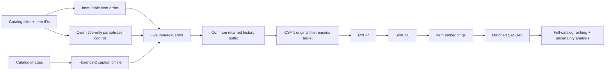

# Nghiên cứu hai phương pháp LLM2Rec đang hoạt động

> Báo cáo tập trung vào phần quyết định cách hiểu và tái tạo phương pháp. Các trạng thái vận hành, lịch sử quyết định, lỗi notebook, quota và tiểu tiết đóng gói đã được lược bỏ trừ khi chúng ảnh hưởng trực tiếp đến tính đúng đắn khoa học.

## Mục lục

- [Tóm tắt](#tóm-tắt)
- [Phạm vi và phương pháp nghiên cứu](#phạm-vi-và-phương-pháp-nghiên-cứu)
- [Phương pháp 1: Caption augmentation](#phương-pháp-1-caption-augmentation-trước-llm2rec)
- [Phương pháp 2: HaNoRec CF/history-aware hardness](#phương-pháp-2-hanorec-cfhistory-aware-hardness)
- [So sánh trực tiếp](#so-sánh-trực-tiếp)
- [Khuyến nghị thực thi và kiểm định](#khuyến-nghị-thực-thi-và-kiểm-định)
- [Câu hỏi chưa giải quyết](#câu-hỏi-chưa-giải-quyết)
- [Tài liệu tham chiếu](#tài-liệu-tham-chiếu)

## Tóm tắt

Hai phương pháp can thiệp vào hai tầng khác nhau của hệ thống. **Caption augmentation** biến hình ảnh catalog thành văn bản offline rồi đưa văn bản đó vào pipeline huấn luyện LLM2Rec. Nó kiểm tra liệu bằng chứng thị giác có giúp học item representation tốt hơn hay không. **HaNoRec CF/history-aware hardness** không huấn luyện lại LLM2Rec hoặc SASRec; nó dùng SASRec đã đóng băng để đo độ khó có điều kiện theo người dùng, sau đó dùng độ khó này để điều chỉnh DPO và rerank top-20 candidate bằng Qwen2.5-VL.

Điểm phân biệt quan trọng: phương pháp thứ nhất thay đổi **thông tin đầu vào và representation được học**; phương pháp thứ hai thay đổi **cường độ tối ưu preference và thứ tự candidate sau truy hồi**. Vì vậy không được gộp chúng thành một claim “multimodal fusion”. Mỗi phương pháp có đối chứng riêng để tách hiệu ứng thật khỏi hiệu ứng văn bản dài hơn, paraphrase, liên kết ảnh sai, semantic similarity hoặc biến thiên của bộ truy hồi.

## Phạm vi và phương pháp nghiên cứu

- **Phạm vi:** mã nguồn, protocol, kế hoạch và artifact mô tả hai thí nghiệm trong handoff `plans/handoffs/two-llm2rec-methods-20260919-1517.md`.
- **Nguồn nội bộ chính:**
  - `code/llm2rec/visual_delta_fusion/README.md`
  - `code/llm2rec/hanorec_cf_hardness/experiment.json`
  - `plans/260915-0955-visual-delta-fusion-pilot/`
  - `plans/260918-1114-hanorec-cf-hardness/`
- **Nguồn bên ngoài đối chiếu:** paper/repository LLM2Rec, paper/repository HaNoRec, model cards Florence-2 và Qwen2.5-VL.
- **Tiêu chí:** đúng với protocol cục bộ đã đóng băng; phân biệt author claim với phân tích; không coi smoke test, loss hoặc corpus completion là bằng chứng hiệu quả.
- **Giới hạn:** chưa có kết quả hạ nguồn đầy đủ cho caption augmentation và chưa có kết quả độc lập đầy đủ của sáu nhánh HaNoRec trong nguồn nội bộ được nghiên cứu.

## Phương pháp 1: Caption augmentation trước LLM2Rec

### 1.1. Câu hỏi khoa học

LLM2Rec dùng văn bản item để điều chỉnh LLM, tạo item embeddings, rồi đưa các embedding đó vào SASRec. Tiêu đề ngắn thường không mô tả màu sắc, hình dạng, bao bì, chất liệu hoặc chủ đề trực quan. Caption augmentation kiểm tra câu hỏi hẹp hơn “thêm văn bản có tốt hơn không?”:

> Khi mọi nhánh được huấn luyện, cắt lịch sử, seed và đánh giá tương ứng nhau, caption của **đúng hình ảnh item** có cải thiện recommendation vượt qua title gốc, formatting, caption thiếu dữ liệu và paraphrase chỉ dựa trên title hay không?

Đây là một can thiệp **text-mediated**, không phải visual fusion learned at serving time. Ảnh chỉ được dùng để sinh caption offline; SASRec không gọi Florence-2 khi inference.

### 1.2. Pipeline end-to-end

Pipeline này đi từ dữ liệu catalog thô đến ranking cuối cùng. Mỗi khối có một vai trò riêng; không nên hiểu `caption`, `item embedding` và `SASRec` là cùng một loại representation.



#### 1.2.1. Catalog titles và item IDs

**Catalog** là toàn bộ tập item mà hệ thống có thể xếp hạng, không chỉ các item xuất hiện trong một batch. Trong thí nghiệm này catalog trải trên sáu miền AmazonMix-6: Arts/Crafts/Sewing, Electronics, Home/Kitchen, Video Games, Movies/TV và Tools/Home Improvement.

Mỗi item có ít nhất:

- `item ID`: định danh được các pipeline khác nhau dùng để tham chiếu cùng một item;
- `title`: tên item gốc, là tín hiệu text ban đầu;
- domain, source ID, downstream ID và ASIN: metadata để crosswalk giữa catalog nguồn, dữ liệu tương tác và artifact sinh caption.

**Item ID không phải user ID.** Item ID định danh sản phẩm; user history là chuỗi các item ID mà một user đã tương tác. Nếu mapping item bị lệch một hàng, caption của sản phẩm A có thể được gắn cho sản phẩm B và toàn bộ contrast `real` sẽ mất ý nghĩa.

Các item thiếu ảnh vẫn giữ trong catalog. Đây là nguyên tắc quan trọng: loại bỏ item thiếu ảnh sẽ làm thay đổi phân phối item, candidate population và full-catalog denominator. Item thiếu ảnh phải được biểu diễn bằng trạng thái/placeholder theo protocol, không bị xóa âm thầm.

#### 1.2.2. Immutable item order

**Immutable item order** là thứ tự item được khóa từ lúc xây catalog đến lúc tạo embedding và chấm điểm. Embedding ở hàng `j` phải luôn tương ứng với item ID ở vị trí `j`; hàng padding được giữ riêng theo quy ước của pipeline.

Thứ tự này là invariant xuyên suốt:

```text
item_id -> catalog_row -> embedding_row -> SASRec score column
```

Nếu thứ tự thay đổi, vector embedding vẫn có thể có đúng shape và code vẫn chạy, nhưng SASRec sẽ chấm điểm embedding của item khác. Đây là lỗi silent corruption, nguy hiểm hơn lỗi crash vì kết quả vẫn trông hợp lệ.

#### 1.2.3. Catalog images

**Catalog image** là hình ảnh được liên kết với item trong manifest. Ảnh phải được tải/giải mã thành RGB và giữ lại provenance như source hoặc hash. Ảnh là đầu vào duy nhất của nhánh caption; nó không đi trực tiếp vào SASRec.

Protocol giữ cả item có ảnh lỗi hoặc không có ảnh để phân biệt:

- item thật sự không có visual evidence;
- ảnh tồn tại nhưng model caption thất bại;
- caption rỗng;
- caption hợp lệ.

Các trạng thái này không nên bị gộp thành một chuỗi rỗng mà không có metadata, vì `null`, `empty` và `decode_failure` có ý nghĩa phân tích khác nhau.

#### 1.2.4. Florence-2 caption offline

**Florence-2** là vision-language model dùng prompt để biến ảnh thành text. Trong pipeline này, prompt `<CAPTION>` yêu cầu một mô tả ngắn cho từng ảnh. `offline` nghĩa là caption được sinh trước khi huấn luyện LLM2Rec và được lưu thành corpus bất biến; tại inference, SASRec không gọi Florence-2.

Luồng xử lý là:

```text
image_i -> Florence-2 -> caption C_i -> lưu theo item_id i
```

`C_i` phải được gắn đúng với item `i`. Caption không phải ground-truth label và cũng không phải target recommendation. Nó chỉ là một nguồn feature text bổ sung cho history/item representation.

**Deterministic decoding** nghĩa là không sampling: cùng model revision, prompt và ảnh sẽ cho output có thể tái lập gần như theo protocol. `max_new_tokens=128` là trần số token sinh, không phải cam kết mọi caption dài 128 token. Beam search giữ các chuỗi ứng viên có xác suất cao thay vì lấy mẫu ngẫu nhiên.

Điểm cần nhớ: Florence-2 có thể mô tả sai, đọc nhầm chữ hoặc lặp lại title. Vì vậy việc sinh caption thành công chỉ chứng minh pipeline tạo được text; nó chưa chứng minh caption mang visual signal hữu ích.

#### 1.2.5. Qwen title-only paraphrase control

**Paraphrase control** là một đối chứng tạo thêm text chỉ từ title, không đọc ảnh. Qwen2.5-3B-Instruct nhận `T_i` và viết lại thành `P_i`, với prompt cấm thêm thuộc tính không có trong title.

Mục đích không phải tạo một model caption thứ hai. Mục đích là đo **text expansion effect**:

```text
title ngắn -> paraphrase dài hơn -> kiểm tra gain do thêm text hay do ảnh
```

Nếu `paraphrase` cũng tăng hiệu quả gần bằng `real`, claim “ảnh giúp recommendation” yếu đi: hệ thống có thể chỉ hưởng lợi từ diễn đạt phong phú hơn, token budget khác hoặc formatting.

#### 1.2.6. Five item-text arms

**Arm** là một nhánh thí nghiệm được định nghĩa trước, với cách tạo item text riêng nhưng dùng cùng data split, seed policy và downstream protocol. Năm arms không chỉ là năm input khác nhau; chúng là năm phép so sánh nhân quả:

- `title-only`: chỉ title gốc;
- `null`: title cộng placeholder `unavailable`;
- `real`: title cộng caption của đúng ảnh item;
- `shuffle`: title cộng caption của item khác;
- `paraphrase`: title cộng text viết lại từ chính title.

Việc tạo arms trước khi huấn luyện giúp tránh chọn nhánh sau khi đã thấy kết quả. Quan trọng nhất là `real` và `shuffle` có cùng kiểu template, gần cùng phân phối caption, nhưng chỉ `real` bảo toàn quan hệ item–image.

#### 1.2.7. Common retained history suffix

**History** là chuỗi item user đã tương tác trước target. **Retained history suffix** là phần cuối của chuỗi được giữ lại sau giới hạn context/token. **Common** nghĩa là mọi arm dùng cùng chính sách giữ lịch sử.

Caption làm item text dài hơn. Nếu mỗi arm tự cắt history theo cách riêng, arm `real` có thể nhìn thấy ít item quá khứ hơn `title-only`. Khi đó kết quả bị trộn giữa:

1. thông tin visual;
2. số lượng item history còn lại;
3. vị trí token và truncation.

Common suffix loại bỏ confound này. Nó không làm các text giống nhau về độ dài; nó chỉ đảm bảo phần history được giữ lại được quyết định theo cùng một quy tắc.

#### 1.2.8. CSFT và original title target

**CSFT (Collaborative Supervised Fine-Tuning)** là giai đoạn dùng chuỗi tương tác để đưa tín hiệu collaborative filtering vào LLM. LLM đọc history text của một user và học dự đoán item kế tiếp.

Trong caption experiment, input history thay đổi theo arm, nhưng **target vẫn là title gốc của item kế tiếp**:

```text
history text của arm -> dự đoán original title của next item
```

Đây là điểm kiểm soát cốt lõi. Nếu target cũng đổi thành caption, thí nghiệm sẽ không còn đo recommendation từ caption augmentation; nó đồng thời đổi nhiệm vụ học từ “dự đoán item title” sang “dự đoán mô tả ảnh”.

`CSFT; original title remains target` vì vậy có nghĩa: caption chỉ làm giàu evidence trong input/history, không được thay đổi nhãn cần dự đoán.

#### 1.2.9. MNTP

**MNTP (Masked Next Token Prediction)** là giai đoạn huấn luyện representation sau CSFT. Khác với causal language modeling thông thường, model được điều chỉnh để dùng thông tin hai chiều quanh token bị mask nhằm tạo embedding giàu ngữ cảnh hơn.

Vai trò của MNTP trong pipeline không phải sinh caption hay sinh recommendation trực tiếp. Nó biến LLM đã nhận tín hiệu sequence thành một encoder-like representation có thể dùng ở cấp item. Nếu caption chỉ xuất hiện ở MNTP trong ablation `late-text`, ta kiểm tra liệu visual text có hữu ích khi xây embedding nhưng không tham gia CSFT hay không.

#### 1.2.10. SimCSE

**SimCSE** là contrastive learning objective để điều chỉnh không gian embedding. Các representation được xem là tương đồng được kéo gần nhau; các representation không tương đồng bị đẩy ra theo objective đã đăng ký.

Trong pipeline, SimCSE giúp item embeddings có hình học hữu ích hơn cho downstream retrieval/sequential recommendation. Nó không phải phép đo visual quality. Một caption tốt cho con người vẫn có thể không tạo embedding tốt; ngược lại, embedding có metric tốt không chứng minh caption đúng từng thuộc tính ảnh.

#### 1.2.11. Item embeddings

**Item embedding** là vector dense đại diện cho một item sau CSFT → MNTP → SimCSE/IEM. Đây là sản phẩm trung gian chính của LLM2Rec:

```text
item text + learned LLM representation -> vector e_i
```

Embedding phải có đúng một hàng cho mỗi item, đúng thứ tự catalog, cùng dimensionality giữa các arm. Embedding không phải raw caption: caption là chuỗi text quan sát được; embedding là vector đã qua nhiều bước học và có thể chứa cả semantic lẫn collaborative signal.

Kiểm tra không rò token tương lai bảo đảm embedding item không được tạo từ target hoặc thông tin chỉ xuất hiện sau thời điểm dự đoán. Kiểm tra padding bảo đảm hàng padding không bị biến thành một item thật hoặc ảnh hưởng điểm SASRec.

#### 1.2.12. Matched SASRec

**SASRec** là sequential recommender dùng self-attention trên chuỗi item để dự đoán item tiếp theo. Ở đây SASRec nhận item embeddings do từng arm tạo ra, thay vì dùng một representation khác.

**Matched** nghĩa là các arm dùng cùng kiến trúc, split, training protocol, target, candidate/full-catalog procedure và seed policy. Chỉ nguồn item text/embedding thay đổi theo arm. Nếu SASRec của `real` được train khác số bước hoặc khác dữ liệu, contrast không còn cô lập caption effect.

SASRec vẫn là tầng recommendation cuối; nó không biết caption đến từ Florence-2 và cũng không gọi vision model. Nó chỉ nhận chuỗi các item embedding và xuất score cho toàn catalog.

#### 1.2.13. Full-catalog ranking

**Full-catalog ranking** là chấm điểm target cùng toàn bộ item hợp lệ trong catalog, sau đó sắp xếp theo score. Đây không phải đánh giá trên một tập negative nhỏ được lấy mẫu ngẫu nhiên.

Full-catalog evaluation trả lời: target thực nằm ở vị trí bao nhiêu khi cạnh tranh với mọi item mà hệ thống có thể đề xuất? Vì target không được chèn nhân tạo, metric phản ánh cả chất lượng representation và khả năng phân biệt trong population thực.

#### 1.2.14. Uncertainty analysis

**Uncertainty analysis** đo mức chắc chắn của chênh lệch giữa các arms, không chỉ nhìn vào mean. Protocol dùng nhiều seed, ghép cặp theo seed/user và bootstrap phân cấp để tránh coi các user hoặc run phụ thuộc là các quan sát độc lập hoàn toàn.

Kết quả cần đọc theo dạng:

```text
real - title-only
real - null
real - shuffle
real - paraphrase
```

Một chênh lệch dương nhưng khoảng tin cậy rộng hoặc bị mất sau hiệu chỉnh đa so sánh chưa đủ để kết luận visual caption có ích. Ngược lại, `real > shuffle` với bất định phù hợp mới trực tiếp hỗ trợ claim rằng liên kết đúng item–ảnh có giá trị.

### 1.2.15. Tóm tắt luồng dữ liệu

```text
catalog item i
  ├─ title T_i
  ├─ image_i -> Florence-2 -> caption C_i
  └─ title T_i -> Qwen paraphraser -> paraphrase P_i

(T_i, C_i/P_i/placeholder/không bổ sung)
  -> arm-specific history
  -> CSFT với target title gốc
  -> MNTP
  -> SimCSE/IEM
  -> embedding e_i
  -> matched SASRec
  -> full-catalog rank
  -> paired metrics + uncertainty
```

Tóm lại, pipeline không kiểm tra “model nhìn ảnh trực tiếp khi serving”. Nó kiểm tra một giả thuyết hẹp hơn: **ảnh được dịch thành text đúng item trước huấn luyện có làm thay đổi representation và ranking theo hướng tốt hơn các đối chứng text tương ứng hay không**.

### 1.3. Năm nhánh đối chứng

Gọi title là `T_i`, caption đúng là `C_i`, paraphrase là `P_i`:

```text
F(T, Z) = "Title: " + T + "; Visual cues: " + Z
```

| Nhánh | Item text | Ý nghĩa nhân quả |
|---|---|---|
| `title-only` | `T_i` | baseline văn bản được huấn luyện lại tương ứng |
| `null` | `F(T_i, unavailable)` | tách hiệu ứng formatting và placeholder/missingness |
| `real` | `F(T_i, C_i)` | thông tin ảnh đúng item |
| `shuffle` | `F(T_i, C_{π(i)})` | cùng phân phối caption nhưng phá liên kết item–ảnh |
| `paraphrase` | `F(T_i, P_i)` | văn bản bổ sung do title, không có bằng chứng thị giác |

`shuffle` là đối chứng quan trọng nhất cho visual specificity. Caption được hoán vị lệch trong các bin tần suất để giữ phân phối độ phổ biến gần tương đương nhưng không có fixed point. Nếu `real` không vượt `shuffle`, phần tăng thêm không thể quy cho việc caption đúng item.

Tất cả nhánh dùng cùng chính sách giữ lại hậu tố lịch sử, nhằm tránh việc nhánh có caption dài hơn được nhìn thấy ít lịch sử hơn do truncation. Target của CSFT vẫn là **title gốc của item kế tiếp**. Đổi target thành caption sẽ thay đổi task và làm mất tính so sánh.

### 1.4. Huấn luyện và đường suy luận

Mỗi nhánh chạy lại cùng DAG:

1. **CSFT:** huấn luyện causal trên lịch sử text của nhánh; target kế tiếp giữ nguyên title gốc.
2. **MNTP:** chuyển representation sang chế độ dùng ngữ cảnh hai chiều theo protocol LLM2Rec.
3. **SimCSE:** regularize embedding space bằng contrastive objective.
4. **IEM/extraction:** tạo một embedding cho mỗi item, giữ nguyên item order và hàng padding zero; kiểm tra không rò token tương lai và bất biến padding.
5. **SASRec:** nhận item embeddings tương ứng; mọi nhánh dùng cấu hình và quy trình khớp nhau.
6. **Evaluation:** xếp hạng trên toàn catalog theo từng user, không chèn target nhân tạo.

Có ba ablation giúp định vị nơi caption tạo giá trị:

- `late-text`: caption chỉ xuất hiện từ MNTP/SimCSE/extraction, không xuất hiện trong CSFT.
- `csft-only`: caption chỉ xuất hiện trong CSFT, còn các giai đoạn representation sau dùng title gốc.
- `native-title`: không áp dụng chính sách common-history truncation, để đo chi phí của việc chuẩn hóa độ dài lịch sử.

Các ablation này phân biệt ba giả thuyết: caption giúp học user–item sequence; caption giúp item embedding; hoặc kết quả chỉ do thay đổi budget/tokenization của history.

### 1.5. Chỉ số và tiêu chí kết luận

Chỉ số chính là `NDCG@10`; phụ là `Recall@10`, `NDCG@20`, `Recall@20` trên full catalog:

```text
Recall@K = 1[r <= K]
NDCG@K   = 1[r <= K] / log2(r + 1)
```

Protocol cần ba seed `2024/2025/2026`, ghép cặp theo seed và user, báo cáo mean, standard deviation, absolute/relative effect, và bootstrap phân cấp seed–user. Tám contrast chính (bốn đối chứng × hai dataset) phải dùng khoảng tin cậy đã hiệu chỉnh đa so sánh.

Claim “visual caption có ích” chỉ được chấp nhận nếu `real` vượt các nhánh tương ứng `title-only`, `null`, `shuffle` và `paraphrase` trên cả Games và Arts với bất định đã báo cáo. Một mean dương, một seed, corpus hoàn tất hoặc loss giảm không đủ.

### 1.6. Rủi ro diễn giải

- Caption có thể chỉ là OCR hoặc paraphrase title; khi đó gain không phải visual understanding.
- Placeholder, punctuation, độ dài token hoặc truncation có thể tạo gain giả.
- `shuffle` vẫn giữ phân phối caption nhưng không loại bỏ mọi khác biệt lexical giữa item; vì vậy cần đọc effect cùng `paraphrase` và `null`.
- Arts là replication in-domain, không phải out-of-domain holdout.
- Caption quality/coverage là điều kiện cần, không phải bằng chứng recommendation effectiveness.

## Phương pháp 2: HaNoRec CF/history-aware hardness

### 2.1. Vấn đề và ý tưởng cốt lõi

HaNoRec gốc định nghĩa hardness chủ yếu từ quan hệ semantic giữa positive và negative. Cách này không biết bộ truy hồi đang gặp khó khăn đến mức nào đối với **một user và một history cụ thể**. Phương pháp hiện tại bổ sung margin từ SASRec đã đóng băng:

```text
m_CF(h_u, i+, i-) = s_SASRec(h_u, i+) - s_SASRec(h_u, i-)
```

Margin nhỏ nghĩa là SASRec khó phân biệt positive với hard negative trong context đó. Tín hiệu này không thay semantic hardness; nó tạo một trục hardness cộng tác, có điều kiện theo user/history.

### 2.2. Kiến trúc

```mermaid
flowchart LR
    A[Frozen LLM2Rec title embeddings] --> B[Frozen SASRec]
    H[Train histories + targets] --> B
    B --> C[Top non-target hard negatives]
    B --> D[Real top-20 test candidates]
    E[Item title + image] --> F[Qwen2.5-VL]
    F --> G[Semantic hardness lambda_sem]
    C --> I[CF margin lambda_cf]
    G --> J[lambda_sem^w * lambda_cf^(1-w)]
    I --> J
    H --> K[Qwen2.5-VL LoRA SFT]
    K --> L[Hardness-scaled DPO + NoDO]
    J --> L
    L --> M[log P(Yes) - log P(No)]
    D --> M
    M --> N[Reranked top-20]
```

Phương pháp giữ nguyên backbone retrieval để câu hỏi chỉ còn là: **hardness có điều kiện theo CF giúp preference optimization/reranking tốt hơn semantic hardness không?** Nếu retriever cũng được thay đổi đồng thời, không thể biết gain đến từ hardness hay từ retrieval.

### 2.3. Dữ liệu đầu vào và pair construction

- Frozen LLM2Rec title embeddings từ checkpoint Qwen2-0.5B.
- Frozen SASRec Games, hidden size 128, 2 layers, 2 heads, dropout 0.3, max history length 10.
- Mỗi training row cần ít nhất ba item history; dùng ba item cuối trước target làm `h_u`.
- Positive `i+` là target kế tiếp thực.
- Chấm điểm toàn catalog bằng SASRec.
- Negative `i-` là non-target có score cao nhất sau khi loại padding và các tương tác tương lai đã biết bằng prefix expansion chính xác.
- Lưu `cf_margin` cùng mọi định danh và thứ tự item.

Loại trừ future interactions giảm false negative, nhưng không giải quyết được positive chưa quan sát. Vì vậy negative được gọi là “hard candidate”, không được diễn giải chắc chắn là item user không thích.

Đánh giá dùng đúng top-20 candidate do SASRec sinh ra. Target không được chèn nhân tạo. Do đó `candidate_recall@20` là trần của reranker: target không nằm trong candidate thì reranker không thể khôi phục.

### 2.4. Hai nguồn hardness và cách kết hợp

**Semantic hardness.** Qwen2.5-VL tạo text/vision embeddings; similarity profile của item được chọn và item bị từ chối được xây từ top-K neighborhood, rồi đo khoảng cách giữa hai profile và chuẩn hóa theo quy ước HaNoRec.

**CF hardness.** Protocol cố định:

```text
lambda_cf = sigmoid(m_CF) / sigmoid(mean(m_CF over batch))
```

Không được đảo dấu sau khi thấy kết quả. Tên “hardness” phụ thuộc quy ước scaling của HaNoRec; điều cần bảo toàn là đúng công thức và đúng mapping vào DPO.

**Geometric mixture:**

```text
lambda_combined = lambda_sem^w * lambda_cf^(1-w)
```

Ba nhánh:

- `w=1.0`: semantic-only, đối chứng HaNoRec.
- `w=0.0`: CF-only.
- `w=0.5`: kết hợp hai nguồn.

Mỗi nhánh chạy với ảnh `real` và ảnh `shuffle`, tổng cộng sáu cell. Real–shuffle phải dùng cùng pair/candidate protocol; nếu không, chênh lệch có thể do sample composition thay vì visual evidence.

### 2.5. SFT, DPO và reranking

**Policy.** Qwen2.5-VL-3B-Instruct được nạp 4-bit, fine-tune bằng LoRA trên `q_proj`, `k_proj`, `v_proj`, `o_proj`, rank 8, alpha 32, dropout 0.05.

**SFT.** Prompt chứa ba item history và một candidate, mỗi item có title/image. Model trả lời binary:

```text
Based on the user's history, will they like this candidate item next? Answer Yes or No.
```

Positive được huấn luyện là `Yes`. Bundle SFT phải bảo toàn pair, eval rows, image paths/hashes, hardness arrays, item order và reference metadata.

**DPO.** Mỗi training pair tạo hai preference examples:

- positive: chọn `Yes`, từ chối `No`;
- hard negative: chọn `No`, từ chối `Yes`.

Responsiveness và hardness điều chỉnh beta theo từng example:

```text
beta_i = max(1e-6, beta0 * responsiveness_i * lambda_combined_i)
```

NoDO tạm thời perturb LoRA parameters trong policy forward. Reference forward dùng base model với adapter disabled và không bị perturb. Loss là negative log-sigmoid của policy-vs-reference preference logit đã scaling. Fail-closed khi loss non-finite hoặc LoRA không thay đổi.

**Reranking.** Mỗi candidate trong real top-20 được chấm đúng một lần bằng:

```text
score(candidate) = log P(Yes) - log P(No)
```

Sắp xếp giảm dần; lưu ranking, target rank, `NDCG@10`, `Recall@10` và `candidate_recall@20`.

### 2.6. Quy mô và chỉ số

Protocol full run cố định ở 530 training pairs, 265 evaluation users, history length 3, top-20 candidates, seed 2024, hai bước SFT và hai bước DPO. Đây là quy mô theo ngân sách, không phải full convergence hay variance estimate đủ cho publication.

Chỉ số chính:

- `NDCG@10` sau rerank trên SASRec real top-20.
- `Recall@10` trên cùng candidate set.
- `candidate_recall@20` như diagnostic ceiling, phải báo cáo riêng.

Phép tương phản bắt buộc là `real - shuffle` tại từng `w`. Quy tắc thắng chỉ hợp lệ khi confidence interval của contrast không chứa zero. Không được lấy một mean tốt tại `w=0.5` làm kết luận nếu không so với `w=1`, `w=0` và shuffle tương ứng. HR@3/NDCG@3 của protocol HaNoRec gốc là phụ, không được trộn với top-20 LLM2Rec protocol.

### 2.7. Rủi ro diễn giải

- Hard negative có thể là positive chưa quan sát; DPO có thể học từ nhãn sai.
- Reranker bị giới hạn bởi candidate recall; gain không đồng nghĩa retriever tốt hơn.
- Một seed, hai bước và 530 pairs chỉ đủ cho feasibility/controlled comparison, không đủ khẳng định ổn định.
- Real–shuffle có thể bị nhiễu bởi ảnh lỗi, khác biệt preprocessing hoặc pair mismatch; hash và row identity phải được audit.
- Chi phí Qwen2.5-VL lặp lại cho sáu nhánh khiến sample size nhỏ; confidence interval quan trọng hơn loss.

## So sánh trực tiếp

| Chiều | Caption augmentation | HaNoRec CF/history-aware hardness |
|---|---|---|
| Tầng can thiệp | Trước CSFT và item embedding extraction | Preference weighting và reranking sau frozen retrieval |
| LLM multimodal | Florence-2 chuyển ảnh thành text offline | Qwen2.5-VL trực tiếp đọc title + image |
| LLM2Rec/SASRec | Chạy lại tương ứng theo từng text arm | Embeddings và SASRec đóng băng |
| Tín hiệu mới | Caption liên kết item–ảnh | Margin SASRec có điều kiện theo user/history |
| Đầu ra | Item embeddings mới rồi SASRec ranking | Top-20 candidate được rerank |
| Đối chứng quyết định | `title-only`, `null`, `shuffle`, `paraphrase` | real vs shuffle tại `w=1, 0, 0.5` |
| Claim cần kiểm tra | Visual evidence cải thiện representation/recommendation | CF-aware hardness cải thiện adaptive preference/reranking |
| Trần đánh giá | Full-catalog ranking | Candidate recall@20 của frozen SASRec |
| Rủi ro lớn nhất | Textual/length/OCR confound | False negative và candidate ceiling |

Hai phương pháp có thể bổ trợ về mặt nghiên cứu nhưng không nên ghép trước khi đánh giá độc lập. Caption augmentation trả lời “nên đưa bằng chứng ảnh vào representation bằng text hay không?”. HaNoRec trả lời “sau khi retriever đã chọn candidate, nên ưu tiên học những cặp nào và với cường độ nào?”.

## Khuyến nghị thực thi và kiểm định

1. **Caption:** hoàn tất và audit catalog corpus trước; kiểm tra coverage, manifest, hash, ID continuity và common-history suffix. Chỉ sau đó mới chạy năm text arms và downstream DAG.
2. **Caption:** khóa cùng split, seed, target, truncation và SASRec configuration giữa các arms. Báo cáo real–shuffle cùng paraphrase/null, không chỉ real–title.
3. **HaNoRec:** xác minh SFT bundle trước khi chạy nhánh DPO. Mọi nhánh phải trỏ đến đúng frozen embeddings, SASRec checkpoint, pair order và image hashes.
4. **HaNoRec:** giữ candidate set nguyên bản của SASRec; báo cáo `candidate_recall@20` cạnh NDCG/Recall để không nhầm reranking gain với retrieval gain.
5. **Cả hai:** lưu kết quả âm, nhánh bị bỏ qua và confidence interval; `COMPLETE`, loss giảm hoặc average dương không phải bằng chứng khoa học.
6. **Diễn giải:** tách ba câu hỏi: có tín hiệu ảnh không, tín hiệu ảnh có được dùng đúng item không, và tín hiệu đó có cải thiện metric với bất định chấp nhận được không.

## Câu hỏi chưa giải quyết

- Caption `real` có vượt `shuffle` sau khi kiểm soát paraphrase, placeholder và token budget không?
- Caption tạo giá trị ở CSFT, MNTP/SimCSE, hay chỉ do thay đổi history truncation?
- CF hardness có cải thiện so với semantic-only ở cả ba `w` khi confidence interval được tính trên cùng pair/candidate set không?
- Mức candidate recall của SASRec giới hạn bao nhiêu phần trăm lợi ích tối đa của HaNoRec?
- Các hard negative chưa quan sát có làm thay đổi kết luận DPO không?
- Kết quả có tái lập ngoài Games/Arts hoặc với thêm seed không?

## Tài liệu tham chiếu

### Nguồn nội bộ

- `plans/handoffs/two-llm2rec-methods-20260919-1517.md`
- `code/llm2rec/visual_delta_fusion/README.md`
- `code/llm2rec/hanorec_cf_hardness/experiment.json`
- `plans/260915-0955-visual-delta-fusion-pilot/plan.md`
- `plans/260918-1114-hanorec-cf-hardness/plan.md`

### Nguồn bên ngoài

- [LLM2Rec repository](https://github.com/HappyPointer/LLM2Rec) — upstream implementation.
- [LLM2Rec paper](https://arxiv.org/html/2506.21579v1) — LLM adaptation, MNTP/contrastive embedding pipeline and sequential recommendation context.
- [HaNoRec repository](https://github.com/wangyu0627/HaNoRec) — upstream hardness-aware multimodal preference optimization implementation.
- [HaNoRec paper](https://arxiv.org/abs/2511.18740) — HaRS/NoDO motivation and preference optimization design.
- [Florence-2 model card](https://huggingface.co/microsoft/Florence-2-large) — image-to-text model and captioning tasks.
- [Qwen2.5-VL documentation](https://huggingface.co/docs/transformers/model_doc/qwen2_5_vl) — multimodal model interface and supported inputs.

*Research conducted: 2026-09-20.*
