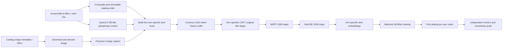

# HANDOFF: Hai phương pháp LLM2Rec đang hoạt động — kiến trúc, huấn luyện, chỉ số và hướng tiếp tục

## Mission and current status

Trọng tâm: "Mô tả và tiếp tục hai thí nghiệm LLM2Rec đang hoạt động: caption augmentation và HaNoRec CF/history-aware hardness".

Nhiệm vụ là hiểu, thực thi và kiểm toán độc lập hai cách khác biệt để bổ sung thông tin đa phương thức vào nhánh nghiên cứu LLM2Rec đã đóng băng:

1. **Caption augmentation trước khi huấn luyện LLM2Rec** — chuyển mỗi hình ảnh trong catalog thành văn bản một lần duy nhất, xây dựng các nhánh đối chứng văn bản tương ứng, rồi chạy lại chuỗi CSFT → MNTP → SimCSE → item-embedding → SASRec của LLM2Rec. Câu hỏi đặt ra là liệu các mô tả trực quan được liên kết đúng có cải thiện khuyến nghị vượt ra ngoài tiêu đề, định dạng và các diễn đạt bổ sung dẫn xuất từ tiêu đề hay không.
2. **HaNoRec CF/history-aware hardness** — giữ nguyên (đóng băng) LLM2Rec và SASRec, sử dụng biên điểm số có điều kiện theo người dùng của chúng như một tín hiệu độ khó cộng tác (collaborative hardness) bên trong quá trình tối ưu ưu tiên kiểu HaNoRec SFT/DPO cho Qwen2.5-VL, sau đó rerank danh sách candidate real top-20 của SASRec. Câu hỏi đặt ra là liệu "khó đối với người dùng/bộ truy hồi này" có phải là tín hiệu huấn luyện ưu tiên tốt hơn so với chỉ dùng độ tương đồng ngữ nghĩa hay không.

**Đã hoàn thành:**
- Phương pháp caption: gói corpus xác định (deterministic), các probe Florence-2 và paraphrase, các kiểm soát chất lượng, sinh dữ liệu toàn catalog có khả năng tiếp tục (resumable), xử lý theo batch, bản sửa lỗi bộ phân tích checkpoint, và kiểm toán checkpoint đầu-cuối đều đã được hiện thực hóa. V8 hoàn thành ở mức 67.929/108.753 bản ghi. V9 đã được chấp nhận sau khi quota được reset và được quan sát ở trạng thái `RUNNING` mà không có lỗi tức thời.
- Phương pháp HaNoRec: công thức và cách xây dựng cặp đã được đóng băng; một smoke test kỹ thuật thực tế 8 cặp/4 người dùng đã hoàn tất; một lần hiệu chuẩn thực tế 40 cặp/20 người dùng đã hoàn tất; đã có số liệu đo chi phí từng giai đoạn; thiết kế nguyên khối (monolithic) thất bại đã được thay thế bằng một script kernel SFT có khả năng resume cộng sáu kernel nhánh DPO/reranking độc lập.

**Còn lại:**
- Phương pháp caption: chờ V9 đạt trạng thái kết thúc, tải về và xác thực manifest/shard của nó, tiếp tục resume cho đến khi đủ toàn bộ 108.753 bản ghi catalog, sau đó xây dựng corpus cho các nhánh và chạy ma trận huấn luyện/đánh giá LLM2Rec hạ nguồn đã đăng ký. Hiện chưa có kết luận nào về hiệu quả khoa học.
- Phương pháp HaNoRec: xác minh đầu ra kết thúc của script kernel SFT, sau đó chạy và kiểm toán toàn bộ sáu kernel nhánh. Tổng hợp kết quả real-vs-shuffle theo cặp tương ứng trên `w ∈ {1.0, 0.0, 0.5}`. Hiện chưa có kết luận hiệu quả ở quy mô đầy đủ.

Mức độ khẩn: cả hai thí nghiệm đều tiêu tốn thời gian GPU Kaggle bị giới hạn quota. Hãy bảo toàn mọi checkpoint hợp lệ và không bao giờ push lại một đơn vị đã hoàn tất mà không thay đổi.

## Scope and guardrails

Workspace: `/home/pearspringmind/rs-wiki`

Trong phạm vi:
- `code/llm2rec/visual_delta_fusion/`
- `plans/260915-0955-visual-delta-fusion-pilot/`
- `experiments/multimodal_llm_rs/kaggle/llm2rec-caption-augmentation/`
- `code/llm2rec/hanorec_cf_hardness/`
- `plans/260918-1114-hanorec-cf-hardness/`
- `experiments/multimodal_llm_rs/kaggle/hanorec-cf-hardness-*`
- Các checkpoint LLM2Rec đóng băng chỉ đọc, title embeddings, checkpoint SASRec, các split dữ liệu, item titles, image manifests, và các bản ghim nguồn thượng nguồn.

Ngoài phạm vi:
- Chỉnh sửa `code/llm2rec/baseline/**` hoặc `code/llm2rec/multimodal/**`.
- Chỉnh sửa các kernel Kaggle lịch sử để lắp ghép lại một phương pháp mới.
- Mở lại các kiến trúc visual-fusion đã đóng hoặc coi các chỉ số của chúng như bằng chứng trực tiếp cho một trong hai phương pháp đang hoạt động.
- Đọc hoặc sửa đổi kết quả sealed-holdout của Baby thuộc kế hoạch reality-check riêng biệt.
- Tuyên bố thành công khoa học dựa trên việc sinh corpus, smoke test, loss huấn luyện, hay một giá trị trung bình dương mà không có các đối chứng đã đăng ký và độ bất định.

Ràng buộc:
- Mỗi script đã được kiểm toán đầy đủ chỉ được push Kaggle một lần; không bao giờ dùng Kaggle làm trình kiểm tra cú pháp.
- Ngân sách thí nghiệm caption: 30 giờ GPU được phê duyệt cho việc sinh corpus, kiểm định nhỏ, và ma trận đã đăng ký. Bộ sinh corpus dùng giới hạn mềm 19.800 giây cho mỗi lần push.
- Các so sánh caption yêu cầu seed toàn chuỗi `2024/2025/2026`; seed shuffle `7001/7002/7003` ghép cặp với chúng.
- Lần chạy HaNoRec quy mô đầy đủ được cố định ở 530 cặp huấn luyện, 265 hàng đánh giá, sáu nhánh, hai bước SFT và hai bước DPO, trừ khi một giao thức mới đã được rà soát thay đổi điều này một cách tường minh.
- Bảo toàn chính xác hash của artifact, revision mô hình, thứ tự item, target, tập candidate, mask, và định danh checkpoint cha.
- Không coi các điểm số title-only lịch sử là đối chứng tương ứng cho thí nghiệm caption; hãy huấn luyện mới các chuỗi title-only tương ứng.
- Làm việc trong phiên chính. Không stage, xóa, hay "dọn dẹp" các tệp đã sửa đổi/chưa theo dõi không liên quan.

Ranh giới an toàn:
- Các PDF trong `raw/` là bất biến.
- Không bao giờ dùng `git reset --hard`; hãy dùng staging có chọn lọc và `git revert` để rollback những gì đã commit.
- Không thay đổi `AGENTS.md` nếu không có sự phê duyệt tường minh của người dùng.
- Không dùng tài khoản Kaggle thay thế chỉ để né tránh giới hạn quota.
- Một kernel `COMPLETE` chứng minh việc thực thi, không chứng minh tính đúng đắn. Hãy tải đầu ra về và xác thực độc lập các hash, số lượng, định danh và chỉ số.

## Current state

Branch: `main`

HEAD: `ef766cc8f27a21b10b2f6a7d2b7fd1b73226c755` (`update: resume caption generation v9`)

Working tree: dirty — quan sát thấy `2` đường dẫn được theo dõi đã sửa đổi và `55` đường dẫn chưa theo dõi. Không có đường dẫn nào được `git status --short` báo cáo là đã stage.

Các tệp đã thay đổi:
- `.codex/mcp/README.md`
- `.codex/mcp/kaggle_mcp_server.py`

Các tệp/thư mục chưa theo dõi có liên quan:
- `code/llm2rec/hanorec_cf_hardness/`
- `experiments/multimodal_llm_rs/kaggle/hanorec-cf-hardness-sft/`
- `experiments/multimodal_llm_rs/kaggle/hanorec-cf-hardness-arm-w10-real/`
- `experiments/multimodal_llm_rs/kaggle/hanorec-cf-hardness-arm-w10-shuffle/`
- `experiments/multimodal_llm_rs/kaggle/hanorec-cf-hardness-arm-w00-real/`
- `experiments/multimodal_llm_rs/kaggle/hanorec-cf-hardness-arm-w00-shuffle/`
- `experiments/multimodal_llm_rs/kaggle/hanorec-cf-hardness-arm-w05-real/`
- `experiments/multimodal_llm_rs/kaggle/hanorec-cf-hardness-arm-w05-shuffle/`
- `experiments/multimodal_llm_rs/kaggle/hanorec-cf-hardness-calibration/`
- `experiments/multimodal_llm_rs/kaggle/hanorec-cf-hardness-full-run-b/`
- `experiments/multimodal_llm_rs/kaggle/hanorec-cf-hardness-preflight/`
- `experiments/multimodal_llm_rs/kaggle/hanorec-cf-hardness-real-run/`
- `plans/260918-1114-hanorec-cf-hardness/`
- Các thư mục gói/lịch sử của thí nghiệm caption nằm dưới `experiments/multimodal_llm_rs/kaggle/llm2rec-caption-augmentation/`
- Các tệp pha kế hoạch caption và báo cáo nằm dưới `plans/260915-0955-visual-delta-fusion-pilot/`
- `plans/handoffs/`
- Còn tồn tại thêm các đường dẫn thí nghiệm, báo cáo, nhật ký và kiểm thử không liên quan; hãy tham khảo một lệnh `git status --short` mới trước khi ghi bất cứ thứ gì.

Các sửa đổi cục bộ có chủ đích: không được ghi nhận. Hãy coi mọi thay đổi có sẵn từ trước là công việc của người dùng/phiên làm việc song song. Artifact handoff là tệp duy nhất được tạo bởi lần chụp trạng thái này.

Trạng thái runtime quan sát được trong phiên này:
- Kernel caption slug `llm2rec-caption-full-corpus-v2-inline`, phiên bản 9: `RUNNING`, thông điệp lỗi rỗng ngay sau khi push.
- Tệp kế hoạch HaNoRec ghi rằng kernel SFT đã tách đã được push và đang chạy. Thông tin này được đọc từ trạng thái repository, không được thăm dò trực tiếp độc lập trong lần chụp handoff này.

## Decisions and rationale

| Quyết định | Lý do | Phương án bị bác bỏ | Tham chiếu |
|---|---|---|---|
| Giữ hai phương pháp tách biệt về mặt khoa học | Caption augmentation thay đổi đầu vào văn bản huấn luyện xuyên suốt LLM2Rec; CF-hardness thay đổi tối ưu ưu tiên và reranking trong khi đóng băng LLM2Rec/SASRec. Gộp chung các tuyên bố sẽ xóa nhòa ranh giới can thiệp. | Gọi cả hai là "multimodal fusion" và gộp chung kết quả | `plan.md` của caption; `plan.md` của HaNoRec |
| Can thiệp caption là tiêu đề xác định + caption ảnh, không phải một mô-đun fusion được học | Nó kiểm tra xem thông tin trực quan được dịch sang không gian văn bản bản địa của LLM2Rec có giúp ích hay không mà không thêm kiến trúc fusion tại thời điểm phục vụ. | Một mạng late-fusion khác | `plans/260915-0955-visual-delta-fusion-pilot/plan.md` |
| Dùng năm nhánh caption tương ứng | `title-only`, `null`, `real`, `shuffle`, và `paraphrase` cô lập văn bản gốc, định dạng/dấu hiệu thiếu dữ liệu, liên kết ảnh đúng, liên kết bị phá vỡ, và các diễn đạt bổ sung dẫn xuất từ tiêu đề. | Chỉ so real với title-only | `experiment.json` và kế hoạch của caption |
| Sinh caption một lần, offline | Bộ khuyến nghị không được gọi Florence-2 khi suy luận. Catalog dẫn xuất là đầu vào bất biến cho huấn luyện. | Sinh caption trực tuyến trong lúc xếp hạng | Pha 2 của caption |
| Giữ nguyên target tiêu đề gốc trong CSFT của caption | Chỉ lịch sử/biểu diễn item nhận can thiệp; thay đổi nhãn item kế tiếp sẽ thay đổi bản thân bài toán. | Huấn luyện trên target là caption | Dòng 28-30 trong kế hoạch caption |
| Dùng chung một hậu tố lịch sử được giữ lại trên tất cả các nhánh caption | Nếu không, văn bản tăng cường dài hơn sẽ gây cắt ngắn đặc thù theo can thiệp và làm nhiễu phép so sánh. | Để mỗi nhánh giữ lại một lượng lịch sử khác nhau | Hợp đồng thực nghiệm trong kế hoạch caption |
| Thêm CF hardness vào HaNoRec dưới dạng hỗn hợp hình học | Tín hiệu ngữ nghĩa và CF mã hóa những khái niệm mơ hồ khác nhau; các điểm đầu mút `w=1` và `w=0` vẫn là đối chứng có thể diễn giải. | Thay thế semantic hardness bằng một đại lượng vô hướng chưa được kiểm chứng | HaNoRec pha 1, Mục 2 |
| Khai thác negative từ chính tập nhầm lẫn của SASRec đã đóng băng | Phương pháp nên huấn luyện trên các candidate mà bộ truy hồi thực sự gặp khó khăn trong việc phân tách cho người dùng đó. | Negative ngẫu nhiên đồng nhất | HaNoRec pha 1, Mục 3 |
| Đánh giá HaNoRec trên danh sách real top-20 của SASRec | Điều này đo ích lợi của reranking trong ngăn xếp LLM2Rec và phơi bày trần recall của candidate do bộ truy hồi tạo ra. | Giao thức 10-candidate tổng hợp bản địa của HaNoRec làm chỉ tiêu chính | HaNoRec pha 1, Mục 4 |
| Tách HaNoRec thành một kernel SFT cộng sáu kernel nhánh | Hai lần push notebook nguyên khối đã chạm giới hạn timeout ô 1.800 giây và trần phiên thực tế xấp xỉ sáu giờ. Script kernel tránh được timeout của Papermill và các nhánh độc lập có thể thử lại. | Lần thử notebook nguyên khối thứ ba | HaNoRec pha 2, Mục 7 |
| Dùng LF vật lý để nạp JSONL của caption | Một ký tự Unicode NEL thô (`U+0085`) bên trong JSON hợp lệ bị `str.splitlines()` hiểu nhầm là ranh giới dòng. | Thử lại nhiều lần hơn hoặc đổi phương thức truyền checkpoint | `ISSUES.md` #32 của caption |

## Phương pháp 1 — Caption augmentation trước LLM2Rec

### Câu hỏi nghiên cứu từ các nguyên lý cơ bản

LLM2Rec là mô hình lấy văn bản làm gốc: tiêu đề item được dùng để thích nghi một mô hình ngôn ngữ nhỏ và để trích xuất item embeddings. Một hình ảnh trong catalog có thể chứa các thuộc tính không có trong một tiêu đề ngắn — màu sắc, bao bì, hình dạng, chủ đề, chất liệu, hoặc loại sản phẩm. Phương pháp này dịch mỗi hình ảnh thành một gợi ý văn bản cố định trước khi huấn luyện, cho phép pipeline LLM2Rec hiện có tiêu thụ bằng chứng trực quan mà không cần fusion ở mức kiến trúc.

Câu hỏi nhân quả không đơn thuần là "nhiều văn bản hơn có giúp ích không?" Mà là:

> Liệu **liên kết item-hình ảnh đúng** có bổ sung giá trị khuyến nghị vượt ra ngoài tiêu đề gốc, một dấu hiệu định dạng, và các diễn đạt bổ sung chỉ từ tiêu đề, khi mọi nhánh đều nhận được tối ưu hóa, mức giữ lại lịch sử, seed và đánh giá tương ứng nhau?

### Kiến trúc



### Đầu vào và đầu ra, theo trình tự

1. **Đầu vào định danh catalog**
   - Sáu miền AmazonMix-6: Arts/Crafts/Sewing, Electronics, Home/Kitchen, Video Games, Movies/TV, Tools/Home Improvement.
   - Kích thước catalog hỗn hợp đầy đủ được ghi nhận bởi định danh của lần sinh dữ liệu: `108,753` item.
   - Mỗi hàng giữ lại miền, ID nguồn, ID hạ nguồn, ASIN, tiêu đề gốc và thứ tự nguồn. Các item thiếu ảnh vẫn giữ nguyên hàng; chúng không bị loại bỏ âm thầm.

2. **Sinh caption từ ảnh**
   - Đầu vào: `(global_item_id, decoded RGB image)`.
   - Mô hình: `microsoft/Florence-2-large`, revision ghim `f0acedbf9b780e04fe1f9111fcf53187388f3d03`.
   - Prompt: `<CAPTION>`.
   - Giải mã: `max_new_tokens=128`, `num_beams=3`, `do_sample=False`, `attn_implementation=sdpa`.
   - Giới hạn batch GPU nội bộ: `4`; beam search làm nở batch hiệu dụng và một batch 64 ảnh đã gây OOM thực sự trên T4.
   - Đầu ra mỗi item: caption thô, trạng thái (`ok`, `empty`, hoặc `decode_failure`), số token được sinh, nguồn gốc/hash của ảnh.

3. **Sinh dữ liệu đối chứng paraphrase**
   - Đầu vào: chỉ tiêu đề gốc; không ảnh, không caption, không tương tác, không nhãn.
   - Mô hình: `Qwen/Qwen2.5-3B-Instruct`, revision `aa8e72537993ba99e69dfaafa59ed015b17504d1`.
   - Giải mã xác định: `max_new_tokens=128`, `do_sample=False`, giới hạn batch GPU nội bộ `4`.
   - Prompt cấm việc thêm dữ kiện hay khuyến nghị.
   - Bằng chứng từ probe: 1/300 trường hợp rõ ràng thêm thông tin không có căn cứ (0,33%); mô hình 0.5B trước đó tạo ra khoảng 54/300 (18%), nên đối chứng 3B được chọn bất chấp việc nó công bố giấy phép `qwen-research`.

4. **Xây dựng các nhánh**

   Gọi tiêu đề là `T_i`, caption thực là `C_i`, và paraphrase chỉ từ tiêu đề là `P_i`:

   ```text
   F(T, Z) = "Title: " + T + "; Visual cues: " + Z
   ```

   | Nhánh | Văn bản item | Cô lập yếu tố |
   |---|---|---|
   | `title-only` | `T_i` | baseline văn bản tương ứng được huấn luyện mới |
   | `null` | `F(T_i, unavailable)` | định dạng và dấu hiệu giá trị bị thiếu |
   | `real` | `F(T_i, C_i)` | mô tả trực quan được liên kết đúng |
   | `shuffle` | `F(T_i, C_pi(i))` | cùng phân phối caption, liên kết item bị phá vỡ |
   | `paraphrase` | `F(T_i, P_i)` | ngôn ngữ bổ sung dẫn xuất từ tiêu đề nhưng không có bằng chứng ảnh |

   Các nguồn cho shuffle được hoán vị lệch (derangement) trong các bin tần suất huấn luyện kích thước `64`, không có điểm bất động và có kiểm tra hoán vị đầy đủ. Giới hạn gợi ý chính là `32` token Qwen2; các mức nhạy cảm dùng cho kiểm định là `16` và `64`.

5. **Artifact corpus có khả năng resume**
   - Các bản ghi được viết theo thứ tự catalog vào các shard JSONL gồm `512` bản ghi.
   - Manifest lưu trữ định danh lần chạy, số bản ghi, số shard, số bản ghi trên mỗi shard, dấu hiệu hoàn tất, và SHA-256 cho mỗi shard.
   - Mỗi lần push có ngân sách mềm `19,800` giây, dùng batch xử lý bên ngoài `8`, ghi một checkpoint cuối, và chỉ resume khi định danh/hash khớp.
   - V8 đã được kiểm toán độc lập: `67,929` bản ghi, `133` shard, toàn bộ hash hợp lệ, ID đúng `0..67,928`. V9 nên resume từ điểm này.

6. **Đường huấn luyện LLM2Rec sau khi corpus hoàn tất**
   - CSFT vẫn là causal. Lịch sử dùng văn bản của nhánh; target dự đoán vẫn là tiêu đề item kế tiếp gốc.
   - Hồ sơ tương thích: CSFT `1,000` bước; MNTP `1,000`; SimCSE `1,000`; chọn checkpoint SimCSE `500` hoặc `1000` chỉ dựa trên tập validation.
   - IEM và quá trình trích xuất là hai chiều (bidirectional) và phải vượt qua kiểm tra độ nhạy với token tương lai cộng với kiểm tra bất biến theo padding.
   - Trích xuất tạo ra một hàng embedding cho mỗi item cộng hàng padding 0, giữ nguyên thứ tự ID.
   - SASRec tiêu thụ item embeddings đã đóng băng thông qua adapter của nó và được huấn luyện y hệt nhau cho các nhánh tương ứng.

7. **Ablation về vị trí giai đoạn**
   - `late-text`: CSFT chỉ dùng tiêu đề, văn bản caption thực chỉ dùng cho MNTP/SimCSE/trích xuất.
   - `csft-only`: CSFT dùng caption thực, tiêu đề gốc cho MNTP/SimCSE/trích xuất.
   - `native-title`: lịch sử tiêu đề gốc không rút ngắn theo lịch sử chung; định lượng chi phí của chính sách lịch sử tương ứng.
   - `real-cap16` và `real-cap64`: chỉ dùng cho kiểm định độ nhạy trên tập Games.

### Chỉ số và tiêu chí chấp nhận khoa học

Chỉ số chính: `NDCG@10` trên toàn catalog.

Chỉ số phụ: `Recall@10`, `NDCG@20`, `Recall@20`.

Với một target được giữ lại có thứ hạng cuối cùng là `r`:

```text
Recall@K = 1[r <= K]
NDCG@K   = 1[r <= K] / log2(r + 1)
```

Phân tích bắt buộc:
- Ba seed toàn chuỗi: `2024`, `2025`, `2026`.
- Ghép cặp các nhánh theo seed và định danh người dùng.
- Báo cáo hiệu ứng theo từng seed, giá trị trung bình, độ lệch chuẩn, hiệu ứng tuyệt đối và tương đối.
- Bootstrap phân cấp theo seed-và-người-dùng với 10.000 lần lặp lại, seed phân tích `9101`.
- Tám phép tương phản chính (bốn đối chứng × hai bộ dữ liệu) tạo thành một họ đa so sánh; báo cáo khoảng tin cậy 95% thông thường và khoảng 99,375% đã hiệu chỉnh Bonferroni.
- Bằng chứng dương ở cấp họ đòi hỏi `real` phải vượt trội hơn các nhánh tương ứng `title-only`, `null`, `shuffle`, và `paraphrase` trên cả Games và Arts, kèm theo độ bất định đã hiệu chỉnh được báo cáo. Riêng việc hoàn tất corpus không phải là bằng chứng.

Các cổng chất lượng trước khi huấn luyện:
- Độ phủ ảnh tối thiểu `0.95`.
- Độ trung thực của paraphrase tối thiểu `0.95`.
- Tỷ lệ thuộc tính caption không có căn cứ tối đa `0.10`.

### Các khó khăn triển khai lớn đã gặp phải

- Gói `transformers` mặc định của Kaggle không tương thích với config tùy chỉnh của Florence-2; runtime được ghim ở `4.44.2`.
- Mã từ xa của Florence có đề cập tĩnh tới `flash_attn`; T4/P100 của Kaggle không thể dùng FlashAttention-2. Một bản vá quét import tĩnh có phạm vi giới hạn chỉ loại bỏ yêu cầu không sử dụng này đồng thời ép dùng SDPA.
- Beam search khiến batch danh nghĩa 64 vượt quá VRAM của T4; cả hai bộ sinh nay đều chia nhỏ batch xuống 4.
- Một checkpoint kernel tự tham chiếu ban đầu thất bại ở shard 69 dù shard này hợp lệ, vì `str.splitlines()` coi ký tự `U+0085` thô bên trong chuỗi JSON là một dòng mới. Bộ nạp nay chỉ tách byte theo `b"\n"` rồi mới giải mã từng bản ghi.
- Các ô notebook của Kaggle có timeout phản hồi quan sát được là 1.800 giây; notebook toàn corpus hiện tại trả về giữa các ô và dùng thiết kế deadline mềm/checkpoint cho tác vụ.
- Quota tuần bị cạn sau V8, rồi được reset; V9 được chấp nhận sau đó.
- Tốc độ sinh dữ liệu duy trì của V8 xấp xỉ `0.922` bản ghi mới/giây. Đây là tốc độ vận hành đo được, không phải thông lượng của mô hình hạ nguồn.

## Phương pháp 2 — HaNoRec CF/history-aware hardness trên các candidate của LLM2Rec

### Câu hỏi nghiên cứu từ các nguyên lý cơ bản

Độ khó (hardness) nguyên bản của HaNoRec mang tính ngữ nghĩa: nếu sản phẩm được chọn và sản phẩm bị từ chối nằm trong các lân cận tương tự nhau trong không gian embedding đa phương thức, thì cặp ưu tiên đó là khó. Điều này bỏ qua người dùng và lịch sử cộng tác. Hai sản phẩm có thể trông giống nhau nhưng lại dễ đối với bộ truy hồi của một người dùng cụ thể, hoặc trông khác nhau nhưng nhận được điểm SASRec gần như y hệt cho người dùng đó.

Phương pháp này bổ sung một tín hiệu có điều kiện theo người dùng:

```text
m_CF(h_u, i+, i-) = s_SASRec(h_u, i+) - s_SASRec(h_u, i-)
```

Biên điểm số nhỏ nghĩa là bộ truy hồi đã đóng băng không thể tự tin phân tách positive và negative cho lịch sử đó. Thí nghiệm đặt câu hỏi liệu việc trọng số hóa DPO theo độ khó CF-aware này có cải thiện một bộ reranker đa phương thức so với HaNoRec chỉ dùng ngữ nghĩa hay không.

### Kiến trúc

```mermaid
flowchart LR
    A[Frozen LLM2Rec title embeddings] --> B[Frozen SASRec]
    C[Train histories and targets] --> B
    B --> D[Top-ranked non-target hard negatives]
    B --> E[Top-20 test candidates]
    F[Item titles + images] --> G[Qwen2.5-VL semantic embeddings]
    G --> H[HaRS semantic hardness lambda_sem]
    D --> I[CF score margin lambda_cf]
    H --> J[Geometric mixture by w]
    I --> J
    C --> K[Qwen2.5-VL LoRA SFT]
    J --> L[HaRS-scaled DPO + NoDO]
    K --> L
    L --> M[Yes-minus-No candidate score]
    E --> M
    M --> N[Reranked top-20]
    N --> O[NDCG@10 / Recall@10 / candidate Recall@20]
```

### Đầu vào và cách xây dựng cặp

1. **Đầu vào của bộ truy hồi đã đóng băng**
   - Ma trận title embedding của checkpoint-500 LLM2Rec Qwen2-0.5B, ghim theo hash.
   - Checkpoint SASRec Games đã đóng băng, ghim theo hash.
   - Các tệp thực `train_data.txt`, `val_data.txt`, `test_data.txt`, `data.txt`, và `item_titles.json`.
   - Cấu hình SASRec: hidden size `128`, `2` lớp, `2` head, dropout `0.3`, độ dài chuỗi tối đa `10`, chấm điểm trên toàn catalog.

2. **Xây dựng cặp huấn luyện**
   - Chọn một hàng huấn luyện thực có ít nhất ba item lịch sử.
   - Lịch sử `h_u`: `3` item cuối cùng trước target.
   - Positive `i+`: target item kế tiếp thực sự.
   - Chấm điểm toàn catalog bằng SASRec đã đóng băng.
   - Negative `i-`: candidate không phải target có điểm cao nhất sau khi loại trừ padding và các tương tác tương lai đã biết được tìm thấy qua các mở rộng chuỗi khớp tiền tố chính xác.
   - Lưu `cf_margin = score(i+) - score(i-)`.

   Việc giảm thiểu false-negative là quan trọng: một "negative" xếp hạng cao có thể là một positive tương lai hợp lý. Các item tương lai đã biết được loại trừ, nhưng các positive chưa được quan sát vẫn là một rủi ro khoa học.

3. **Các hàng đánh giá**
   - Chọn các hàng test thực có ít nhất ba item lịch sử.
   - Tập candidate chính xác là top `M=20` kết quả trên toàn catalog của SASRec đã đóng băng.
   - Target **không được chèn vào một cách nhân tạo**. Do đó `candidate_recall@20` chính là trần của bộ truy hồi: bộ reranker không thể khôi phục một target vắng mặt khỏi danh sách candidate.

4. **Catalog đa phương thức**
   - Với mọi item được tham chiếu bởi các cặp huấn luyện, lịch sử, target, negative, hoặc candidate đánh giá, hãy nạp tiêu đề và một hình ảnh thực từ manifest đã ghim.
   - Diện tích ảnh tối đa: `50,176` pixel; thay đổi kích thước trong khi giữ nguyên tỷ lệ khung hình.
   - Mọi ảnh được tải về đều được băm (hash) và ghi lại.

### Toán học của hardness

1. **Semantic hardness (`lambda_sem`)**
   - Qwen2.5-VL tạo ra embedding văn bản và thị giác cho các item được tham chiếu.
   - Các ma trận tương đồng cosine văn bản và thị giác được hợp nhất.
   - Với mỗi item, giữ lại Top-K lân cận với `K=min(10, catalog_size-1)`.
   - Chuyển các vector điểm số lân cận của item được chọn và item bị từ chối thành các hồ sơ xác suất softmax.
   - Khoảng cách cặp là khoảng cách Euclid giữa các hồ sơ đó.
   - Chuẩn hóa bằng batch normalization dựa trên sigmoid của HaNoRec.

2. **CF hardness (`lambda_cf`)**

   ```text
   lambda_cf = sigmoid(m_CF) / sigmoid(mean(m_CF over batch))
   ```

   Điều này bảo toàn hợp đồng đã đóng băng của Pha 1. Lưu ý rằng mã nguồn gọi nó là hardness mặc dù cách diễn giải phụ thuộc vào quy ước tỷ lệ hóa nguyên bản của HaNoRec; không được đảo ngược hay "sửa" nó sau khi đã thấy kết quả.

3. **Hardness kết hợp**

   ```text
   lambda_combined = lambda_sem^w * lambda_cf^(1-w)
   ```

   Các nhánh:
   - `w=1.0`: đối chứng HaNoRec chỉ dùng ngữ nghĩa.
   - `w=0.0`: can thiệp chỉ dùng CF hardness.
   - `w=0.5`: kết hợp hình học.

   Mỗi trọng số chạy với ảnh `real` và ảnh bị shuffle toàn cục: tổng cộng sáu ô. Các khẳng định tại điểm đầu mút đảm bảo `w=1` bằng chính xác `lambda_sem` và `w=0` bằng chính xác `lambda_cf`.

### Mô hình và triển khai huấn luyện

Policy nền:
- `Qwen/Qwen2.5-VL-3B-Instruct`
- Revision `66285546d2b821cf421d4f5eb2576359d3770cd3`
- Nạp 4-bit BitsAndBytes, tính toán FP16, ghim vào GPU 0.

LoRA:
- Rank `r=8`
- `lora_alpha=32`
- Dropout `0.05`
- Các mô-đun đích: `q_proj`, `k_proj`, `v_proj`, `o_proj`

Cấu hình đã đăng ký cho quy mô đầy đủ:
- Seed `2024`
- Cặp huấn luyện `530`
- Người dùng đánh giá `265`
- Số item lịch sử `3`
- Danh sách candidate `top_m=20`
- Số bước SFT `2`
- Số bước DPO `2`
- Learning rate `1e-4`
- NoDO noise sigma `0.05`
- Base beta `0.1`
- Ngân sách mềm của kernel SFT `4,500s`
- Ngân sách mềm của mỗi kernel nhánh `9,000s`

SFT:
- Prompt chứa ba item lịch sử và một candidate, mỗi thứ kèm nội dung tiêu đề/hình ảnh.
- Câu hỏi: "Based on the user's history, will they like this candidate item next? Answer Yes or No."
- Các candidate positive huấn luyện `Yes` bằng cách dùng log-probability âm của Yes.
- Backward theo từng ví dụ giúp tránh giữ lại đồ thị kích hoạt cho cả một batch.
- Đầu ra: `sft_lora_state.pt` cộng với `sft_bundle.json` di động chứa các cặp, hàng đánh giá, đường dẫn ảnh tương đối, semantic/CF hardness, thứ tự item, các giá trị loss, thời gian, và kiểm tra khả năng tái lập của tham chiếu.

DPO:
- Mỗi cặp ưu tiên tạo ra hai ví dụ nhị phân:
  - Candidate positive: chọn `Yes`, từ chối `No`.
  - Hard negative: chọn `No`, từ chối `Yes`.
- Một lượt thống kê không tính gradient tính các khoảng cách phần thưởng giữa policy và reference cùng độ đáp ứng (responsiveness) của HaNoRec.
- Beta cho từng ví dụ là `max(1e-6, beta0 * responsiveness * lambda_combined)`.
- Trong lượt huấn luyện, NoDO nhiễu loạn tạm thời các ma trận LoRA đang hoạt động với sigma `0.05`; lượt forward của reference đã đóng băng dùng `disable_adapter()` và không bao giờ bị nhiễu loạn.
- Loss cho mỗi ví dụ là log-sigmoid âm của logit ưu tiên policy-so-với-reference đã được tỷ lệ hóa.
- Huấn luyện thất bại an toàn (fail closed) khi loss không hữu hạn hoặc khi các tham số LoRA không thay đổi.

Reranking:
- Chấm điểm mỗi candidate trong 20 candidate của SASRec đúng một lần với `log P(Yes) - log P(No)`.
- Sắp xếp giảm dần.
- Lưu ID người dùng, target, các ID candidate đã xếp hạng, thứ hạng, `ndcg@10`, `recall@10`, và `candidate_recall@20`.
- Đầu ra mỗi nhánh: checkpoint LoRA và `arm_result.json` chứa các giá trị loss, dự đoán, chỉ số tổng hợp, thời gian, trọng số, và điều kiện ảnh.

### Chỉ số và cách diễn giải

Chính:
- `NDCG@10` trên các candidate real top-20 của SASRec sau khi rerank.
- `Recall@10` trên cùng tập candidate đó.

Trần chẩn đoán:
- `candidate_recall@20`: liệu SASRec đã đóng băng có bao gồm target trước khi rerank hay không.

Phép tương phản bắt buộc:
- Trong mỗi mức trọng số, so sánh `real` trừ `shuffle` dưới cùng một tập cặp và cùng một tập candidate.
- Quy tắc thắng của Pha 1: nhánh ảnh real vượt trội hơn nhánh shuffle của nó với khoảng tin cậy không chứa số không.
- `w=1` kiểm tra hành vi HaNoRec chỉ dùng ngữ nghĩa; `w=0` kiểm tra CF hardness thuần túy; `w=0.5` kiểm tra tính bổ trợ. Chỉ riêng một giá trị trung bình thuận lợi ở `w=0.5` là không đủ nếu không có đối chứng tương ứng và độ bất định.

Giao thức mười candidate HR@3/NDCG@3 bản địa của HaNoRec chỉ là thứ yếu và không bao giờ được tính trung bình chung với giao thức top-20 LLM2Rec chính này.

### Chi phí đo được và bằng chứng về khả năng mở rộng

Calibration V2 dùng 40 cặp huấn luyện, 20 người dùng đánh giá, và sáu nhánh đã đăng ký:

| Giai đoạn | Chi phí đo được |
|---|---:|
| Nạp mô hình | 41.90s |
| Semantic embedding | 0.0853 s/item |
| SFT | 0.6198 s/example |
| Lượt thống kê DPO | 0.8358 s/example |
| Lượt huấn luyện DPO | 1.0791 s/example |
| Reranking | 0.4328 s/candidate |

Lần hiệu chuẩn kết thúc sau 2.543,5 giây thời gian thực. Năm nhánh hoàn tất; nhánh thứ sáu dừng lại gọn gàng tại ranh giới ngân sách. Chính các phép đo này, chứ không phải các phỏng đoán dựa trên số lượng tham số, là cơ sở cho lần chạy 530 cặp/265 người dùng.

### Các khó khăn triển khai lớn đã gặp phải

- `device_map="auto"` đã phân mảnh (shard) mô hình lượng tử hóa không đồng đều trên 2×T4 và gây OOM; bản triển khai ghim toàn bộ mô hình vào GPU 0.
- `get_peft_model()` làm biến đổi/bọc mô hình nền; việc giữ một biến Python khác không tạo ra một mô hình tham chiếu độc lập. Logit của reference nay dùng `disable_adapter()` ở chế độ eval.
- Tích lũy các loss rồi gọi backward một lần đã giữ lại nhiều đồ thị kích hoạt và gây OOM. Huấn luyện nay gọi backward cho từng ví dụ với loss đã chuẩn hóa.
- Việc chạy forward riêng biệt cho Yes và No làm tăng gấp đôi chi phí. Cả hai logit nay được đọc từ một lượt forward duy nhất tại vị trí token kế tiếp.
- Việc kiểm tra ngân sách chỉ giữa các nhánh có thể gây vượt quá bên trong các vòng lặp dài. Các lần kiểm tra nay diễn ra bên trong các vòng lặp SFT, thống kê DPO, huấn luyện DPO, và reranking.
- Hai lần chạy notebook nguyên khối kết thúc với `CANCEL_ACKNOWLEDGED`: ô điều phối vượt quá timeout phản hồi 1.800 giây quan sát được của nbclient, và trần phiên nền tảng thực tế là khoảng sáu giờ. Bảy script kernel hiện tại loại bỏ cả hai điểm ghép nối này.
- Việc tải ảnh tuần tự ở quy mô lớn gặp phải các lỗi reset/timeout kết nối thực sự; việc lấy ảnh nay dùng bốn lần thử với độ trễ tăng dần.
- Huấn luyện theo nghĩa đen trên toàn bộ các hàng là bất khả thi: 122.577 cặp × hai ví dụ nhị phân × hai bước DPO × sáu nhánh là khoảng 2,94 triệu lượt lặp ví dụ, dự phóng gần 2.043 giờ GPU trước cả SFT/reranking. "Quy mô đầy đủ" ở đây nghĩa là tập con thực lớn nhất đã đăng ký mà ngân sách đo được hỗ trợ, không phải toàn bộ các hàng.

## So sánh và bản đồ khái niệm

| Chiều so sánh | Caption augmentation | HaNoRec CF hardness |
|---|---|---|
| Vị trí can thiệp | Trước CSFT và trước trích xuất item embedding | Trọng số hóa ưu tiên và reranking sau khi truy hồi đã đóng băng |
| Thành phần đóng băng | Cùng nguồn/cấu hình thượng nguồn trên các nhánh tương ứng, nhưng mỗi nhánh huấn luyện lại toàn chuỗi | Các embedding LLM2Rec và SASRec được đóng băng nghiêm ngặt |
| Vai trò mô hình đa phương thức | Florence dịch ảnh thành văn bản có thể tái sử dụng | Qwen2.5-VL trực tiếp tiêu thụ tiêu đề/hình ảnh trong SFT/DPO/reranking |
| Điều kiện hóa theo lịch sử người dùng | Được học gián tiếp qua huấn luyện LLM2Rec/SASRec | Tường minh trong biên CF và trong từng prompt của reranker |
| Đường phục vụ (serving) | SASRec chuẩn sau khi dẫn xuất văn bản offline; không có mô hình caption trực tuyến | Truy hồi SASRec cộng bộ reranker VL tốn kém trên 20 candidate |
| Đối chứng chính | Caption bị shuffle khớp tần suất cộng các đối chứng paraphrase/null/title | Ảnh real so với ảnh shuffle ở các mức hardness chỉ ngữ nghĩa, chỉ CF, và hỗn hợp |
| Câu hỏi chính | Thông tin caption đúng có cải thiện bộ khuyến nghị không? | Độ khó có điều kiện theo người dùng có cải thiện tối ưu ưu tiên/reranking không? |
| Độ trưởng thành hiện tại | Việc sinh corpus đang tiến hành; hiệu ứng hạ nguồn chưa được đo | Pipeline thực/hiệu chuẩn đã được chứng minh; thực thi phân tách quy mô đầy đủ đang tiến hành |
| Yếu tố chi phí chính | Sinh 108.753 caption/paraphrase, rồi nhiều chuỗi huấn luyện hoàn chỉnh | Lặp lại các lượt forward/backward VL cho sáu nhánh DPO/reranking |
| Rủi ro khoa học chính | Caption chỉ diễn đạt lại/OCR tiêu đề; các diễn đạt bổ sung hoặc việc cắt ngắn, chứ không phải bằng chứng trực quan, mới gây ra cải thiện | Khai thác false-negative, trần candidate-recall, và độ bất định đắt đỏ do mẫu nhỏ |

Hai phương pháp này bổ trợ nhau xét như những câu hỏi nghiên cứu nhưng không nên bị gộp thành một công thức huấn luyện trước khi mỗi bên được đánh giá độc lập. Caption augmentation hỏi liệu bằng chứng trực quan có thể cải thiện **biểu diễn được học bởi LLM2Rec** hay không. CF hardness hỏi liệu LLM2Rec đã đóng băng có thể nhận diện **những ưu tiên đa phương thức nào là đủ khó để xứng đáng nhận cường độ DPO khác nhau** hay không.

## Work performed

- Đã đọc lược đồ handoff và các quy tắc che thông tin (redaction).
- Đã quét các handoff hiện có và xác định hai phương pháp đang hoạt động từ các đường dẫn mã nguồn, kế hoạch, thí nghiệm và gói Kaggle.
- Đã đọc kế hoạch caption, hợp đồng thí nghiệm, các giao diện triển khai, các tệp pha, sổ ghi vấn đề, và bản ghi vận hành V9 hiện tại.
- Đã đọc kế hoạch HaNoRec, đặc tả công thức, báo cáo hiệu chuẩn/mở rộng quy mô, mã chuẩn bị, bản triển khai DPO/SFT, và các tham số kernel quy mô đầy đủ được sinh ra.
- Đã thăm dò sự tồn tại của repository git, thư mục gốc, branch, HEAD, và trạng thái có giới hạn, mỗi lần một lệnh.
- Chỉ tạo ra artifact handoff này. Không có runtime, subagent, thí nghiệm, chỉnh sửa mã, git stage, hay commit nào được khởi chạy như một tác dụng phụ.
- Đã áp dụng 0 lần che thông tin.

## Verification

| Kiểm tra | Lệnh hoặc bằng chứng | Kết quả | Thời điểm |
|---|---|---|---|
| Repository git | `git rev-parse --is-inside-work-tree` | `true` | 2026-09-19 |
| Thư mục gốc workspace | `git rev-parse --show-toplevel` | `/home/pearspringmind/rs-wiki` | 2026-09-19 |
| Branch | `git rev-parse --abbrev-ref HEAD` | `main` | 2026-09-19 |
| HEAD | `git rev-parse HEAD` | `ef766cc8f27a21b10b2f6a7d2b7fd1b73226c755` | 2026-09-19 |
| Trạng thái workspace | `git status --short` | 2 đường dẫn được theo dõi đã sửa đổi, 55 đường dẫn chưa theo dõi, không có đường dẫn đã stage được báo cáo | 2026-09-19 |
| Bộ kiểm thử cục bộ của caption | Quan sát trước đó trong phiên này: `python -m unittest discover -s code/llm2rec/visual_delta_fusion -p 'test_*.py'` | 77/77 đạt trước khi push V9 | 2026-09-19 |
| Biên dịch gói caption | Quan sát trước đó trong phiên này: biên dịch cả chín ô notebook | Đạt trước khi push V9 | 2026-09-19 |
| Trạng thái trực tiếp của caption | Quan sát trước đó trong phiên này qua Kaggle API | V9 `RUNNING`, thông điệp lỗi rỗng | 2026-09-19 |
| Kiểm toán artifact V8 của caption | `ISSUES.md` #33 và bằng chứng trong phiên | 67.929 bản ghi, 133 shard hợp lệ, ID liên tục, toàn bộ hash hợp lệ | 2026-09-17 |
| Smoke test HaNoRec | Bằng chứng từ báo cáo/kế hoạch trong repository | V4 `COMPLETE`, pipeline SFT+DPO thực 8 cặp/4 người dùng | ghi nhận trước handoff này |
| Hiệu chuẩn HaNoRec | `phase-02-calibration-report.md` | V2 `COMPLETE`; 5/6 nhánh hoàn tất và một nhánh bị bỏ qua gọn gàng do ngân sách | ghi nhận trước handoff này |
| Trạng thái trực tiếp quy mô đầy đủ của HaNoRec | Chỉ dựa trên phát biểu trong tệp kế hoạch | Kernel SFT được mô tả là đã push/đang chạy; không được thăm dò trực tiếp độc lập trong lần chụp này | lần chụp 2026-09-19 |

Chưa chạy:
- Không có lệnh gọi trạng thái trực tiếp kernel HaNoRec, vì lần chụp handoff này chỉ mang tính tài liệu và kế hoạch đã ghi nhận trạng thái mới nhất.
- Không có thí nghiệm CSFT/IEM/SASRec hạ nguồn cho caption, vì corpus chưa hoàn tất.
- Không có kiểm toán đầy đủ sáu nhánh HaNoRec, vì việc thực thi phân tách chưa hoàn tất.
- Không dùng `--include-diff`; người dùng không yêu cầu.
- Không có phụ lục `--include-status`; thay vào đó, phần Current state chứa một bản tóm tắt trạng thái có giới hạn.

## Open risks and blockers

- Loại: blocker. Chủ sở hữu: thực thi caption. Tác động: V9 phải đạt trạng thái kết thúc và đầu ra của nó phải được tải về/kiểm toán trước khi thực hiện một lần push resume khác hoặc xây dựng các nhánh.
- Loại: blocker. Chủ sở hữu: thực thi HaNoRec. Tác động: sáu kernel nhánh phụ thuộc vào `sft_bundle.json` và `sft_lora_state.pt` hợp lệ đã hoàn tất; không push các nhánh dựa trên một đầu ra SFT chưa được xác minh.
- Loại: rủi ro. Chủ sở hữu: người bảo trì repository. Tác động: worktree chứa các tệp đã sửa đổi và chưa theo dõi từ phiên song song. Staging có chọn lọc là bắt buộc; việc dọn dẹp có thể phá hủy công việc đang diễn ra.
- Loại: rủi ro. Chủ sở hữu: thí nghiệm caption. Tác động: ngay cả caption hoàn hảo cũng có thể không giúp ích cho khuyến nghị; việc diễn đạt lại tiêu đề, OCR, định dạng, độ dài token, hoặc việc cắt ngắn lịch sử chung đều có thể giải thích các hiệu ứng quan sát được. Các đối chứng đã đăng ký là bắt buộc.
- Loại: rủi ro. Chủ sở hữu: thí nghiệm caption. Tác động: Arts là một bộ dữ liệu nhân rộng trong miền (in-domain), không phải một miền chưa từng thấy hoàn toàn nguyên vẹn. Baby được dành riêng ở nơi khác.
- Loại: rủi ro. Chủ sở hữu: thí nghiệm HaNoRec. Tác động: các non-target xếp hạng cao có thể là các positive chưa được gán nhãn dù đã loại trừ item tương lai, gây sai lệch cho DPO.
- Loại: rủi ro. Chủ sở hữu: thí nghiệm HaNoRec. Tác động: reranking không thể khôi phục các target vắng mặt khỏi top-20 của SASRec; hãy báo cáo candidate recall riêng biệt.
- Loại: rủi ro. Chủ sở hữu: thí nghiệm HaNoRec. Tác động: 530 cặp huấn luyện, 265 người dùng, một seed, và hai bước là một tập con theo ngân sách, không phải sự hội tụ trên dữ liệu đầy đủ hay một ước lượng phương sai sẵn sàng cho công bố.
- Loại: rủi ro. Chủ sở hữu: cả hai thí nghiệm. Tác động: trạng thái `COMPLETE` của Kaggle không phải là sự chấp nhận; định danh artifact, số lượng, hash, và các chỉ số độc lập vẫn là bắt buộc.
- Loại: câu hỏi. Chủ sở hữu: con người/trưởng nhóm nghiên cứu. Tác động: sau khi hoàn tất về mặt kỹ thuật, hãy quyết định việc cấp phát thêm seed/nhân rộng chỉ dựa trên bằng chứng đã đăng ký trước và quota còn lại, chứ không dựa trên các kết quả sớm thuận lợi.

## Exact next actions

1. **Bước an toàn đầu tiên** — thực hiện các kiểm tra trạng thái chỉ đọc cho `llm2rec-caption-full-corpus-v2-inline` V9 và `hanorec-cf-hardness-sft`; ghi lại chính xác trạng thái kết thúc/đang chạy mà không sửa đổi bất kỳ kernel nào.
2. Nếu caption V9 là `COMPLETE`, hãy tải đầu ra về, xác thực định danh manifest, toàn bộ hash shard, tổng số bản ghi, tổng số bản ghi cộng dồn theo shard, tính liên tục của ID, và log kết thúc. Nếu chỉ hoàn tất một phần, chỉ push lại gói đã được kiểm toán mà không thay đổi sau khi xác nhận quota và định danh checkpoint cha. Nếu hoàn tất ở mức 108.753, hãy dừng việc sinh dữ liệu và kiểm toán chất lượng/độ phủ trước khi xây dựng các nhánh.
3. Nếu HaNoRec SFT là `COMPLETE`, hãy tải về và xác thực `sft_bundle.json`, `sft_lora_state.pt`, các đường dẫn/hash ảnh, 530 cặp, 265 hàng đánh giá, các mảng hardness, thứ tự item, khả năng tái lập của reference, và các số liệu thời gian. Chỉ khi đó mới push sáu script kernel nhánh.
4. Với mỗi nhánh HaNoRec, hãy xác minh rằng metadata của nó trỏ tới đúng đầu ra của kernel SFT, sau đó push/giám sát/tải về một cách độc lập. Không bao giờ chạy lại các nhánh đã hoàn tất.
5. Xây dựng một sổ cái HaNoRec sáu ô có thể đọc bằng máy: trọng số, điều kiện ảnh, trạng thái, hash đầu vào, hash checkpoint, thời gian, số dự đoán đã hoàn tất, candidate recall, Recall@10, NDCG@10, và hiệu số real-trừ-shuffle tương ứng.
6. Sau khi corpus caption hoàn tất, hãy xây dựng cả năm nhánh văn bản chính cộng với các tham chiếu vị trí/giới hạn đã đăng ký, tính lại các hậu tố lịch sử chung trên mọi hồ sơ được so sánh, rồi đóng băng DAG giai đoạn duy nhất và dự phóng GPU đo được trước khi huấn luyện.
7. Chạy các trình kiểm toán độc lập thay vì tin vào các trường tổng hợp của kernel. Bảo toàn các kết quả âm/null, các ô bị bỏ qua do ngân sách, và mọi thất bại trong sổ cái vận hành.
8. Cập nhật trạng thái kế hoạch, sổ ghi vấn đề, và `log.md` dưới dạng một commit có chọn lọc cho mỗi thao tác. Không stage các thay đổi worktree không liên quan.

## Source pointers

Caption augmentation:
- `code/llm2rec/visual_delta_fusion/README.md`
- `code/llm2rec/visual_delta_fusion/experiment.json`
- `code/llm2rec/visual_delta_fusion/caption.py`
- `code/llm2rec/visual_delta_fusion/corpus.py`
- `code/llm2rec/visual_delta_fusion/smoke.py`
- `code/llm2rec/visual_delta_fusion/package.py`
- `plans/260915-0955-visual-delta-fusion-pilot/plan.md`
- `plans/260915-0955-visual-delta-fusion-pilot/phase-02-kaggle-package.md`
- `plans/260915-0955-visual-delta-fusion-pilot/phase-03-push-and-verify.md`
- `plans/260915-0955-visual-delta-fusion-pilot/ISSUES.md`
- `experiments/multimodal_llm_rs/kaggle/llm2rec-caption-augmentation/full-corpus-v2-inline/`
- Nguồn mô hình công khai: `https://huggingface.co/microsoft/Florence-2-large`
- Nguồn thượng nguồn công khai: `https://github.com/HappyPointer/LLM2Rec`

HaNoRec CF/history-aware hardness:
- `code/llm2rec/hanorec_cf_hardness/experiment.json`
- `code/llm2rec/hanorec_cf_hardness/prep.py`
- `code/llm2rec/hanorec_cf_hardness/train.py`
- `plans/260918-1114-hanorec-cf-hardness/plan.md`
- `plans/260918-1114-hanorec-cf-hardness/phase-01-local-spec-and-audit.md`
- `plans/260918-1114-hanorec-cf-hardness/phase-02-full-dataset-scaling.md`
- `plans/260918-1114-hanorec-cf-hardness/reports/phase-02-calibration-report.md`
- `experiments/multimodal_llm_rs/kaggle/hanorec-cf-hardness-sft/`
- `experiments/multimodal_llm_rs/kaggle/hanorec-cf-hardness-arm-w10-real/`
- `experiments/multimodal_llm_rs/kaggle/hanorec-cf-hardness-arm-w10-shuffle/`
- `experiments/multimodal_llm_rs/kaggle/hanorec-cf-hardness-arm-w00-real/`
- `experiments/multimodal_llm_rs/kaggle/hanorec-cf-hardness-arm-w00-shuffle/`
- `experiments/multimodal_llm_rs/kaggle/hanorec-cf-hardness-arm-w05-real/`
- `experiments/multimodal_llm_rs/kaggle/hanorec-cf-hardness-arm-w05-shuffle/`
- Nguồn thượng nguồn công khai: `https://github.com/wangyu0627/HaNoRec`

Bối cảnh LLM2Rec dùng chung:
- `code/llm2rec/README.md`
- `code/llm2rec/baseline/README.md`
- `plans/handoffs/llm2rec-direction-20260903-0924.md`
- `rule://kaggle-mcp-experiments`