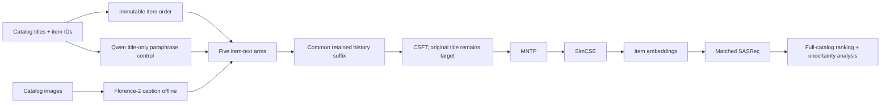
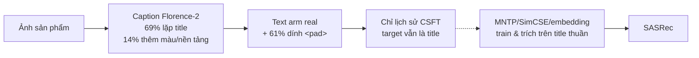
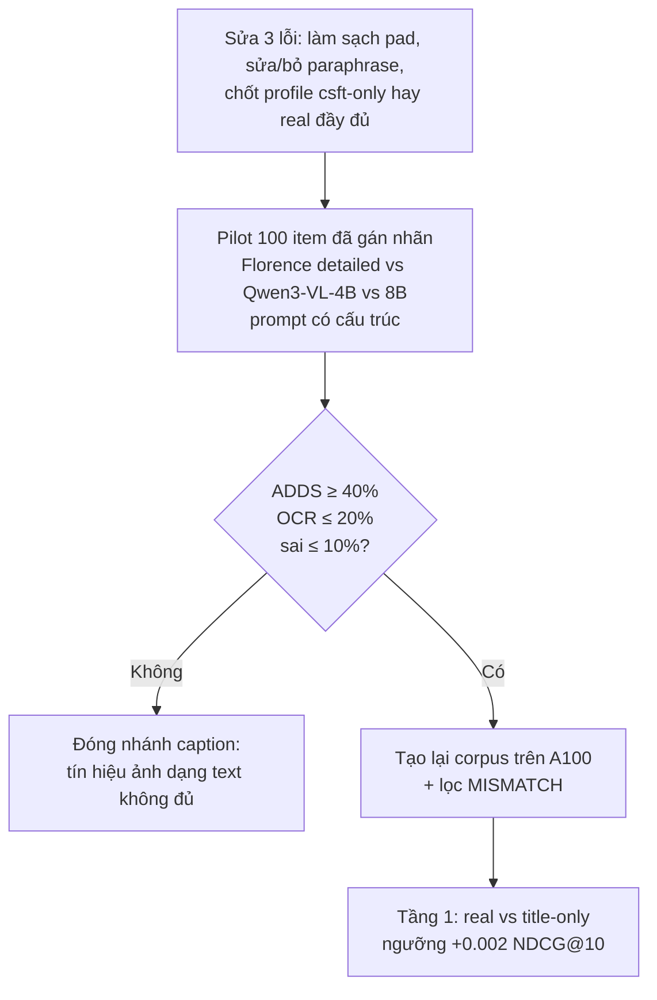

# v10 — Caption Augmentation: thiết kế chi tiết và audit corpus

> Tài liệu kỹ thuật đi kèm `v10-caption-augmentation.md` (báo cáo kết quả). Gộp từ: phần Phương pháp 1 của báo cáo nghiên cứu hai phương pháp (2026-09-20), các khó khăn triển khai trong handoff 2026-09-19, và audit corpus V10.

## 1. Thiết kế phương pháp

### 1.1. Câu hỏi khoa học

LLM2Rec dùng văn bản item để điều chỉnh LLM, tạo item embeddings, rồi đưa các embedding đó vào SASRec. Tiêu đề ngắn thường không mô tả màu sắc, hình dạng, bao bì, chất liệu hoặc chủ đề trực quan. Caption augmentation kiểm tra câu hỏi hẹp hơn “thêm văn bản có tốt hơn không?”:

> Khi mọi nhánh được huấn luyện, cắt lịch sử, seed và đánh giá tương ứng nhau, caption của **đúng hình ảnh item** có cải thiện recommendation vượt qua title gốc, formatting, caption thiếu dữ liệu và paraphrase chỉ dựa trên title hay không?

Đây là một can thiệp **text-mediated**, không phải visual fusion learned at serving time. Ảnh chỉ được dùng để sinh caption offline; SASRec không gọi Florence-2 khi inference.

### 1.2. Pipeline end-to-end

Pipeline này đi từ dữ liệu catalog thô đến ranking cuối cùng. Mỗi khối có một vai trò riêng; không nên hiểu `caption`, `item embedding` và `SASRec` là cùng một loại representation.



#### 1.2.1. Catalog titles và item IDs

**Catalog** là toàn bộ tập item mà hệ thống có thể xếp hạng, không chỉ các item xuất hiện trong một batch. Trong thí nghiệm này catalog trải trên sáu miền AmazonMix-6: Arts/Crafts/Sewing, Electronics, Home/Kitchen, Video Games, Movies/TV và Tools/Home Improvement.

Mỗi item có ít nhất:

- `item ID`: định danh được các pipeline khác nhau dùng để tham chiếu cùng một item;
- `title`: tên item gốc, là tín hiệu text ban đầu;
- domain, source ID, downstream ID và ASIN: metadata để crosswalk giữa catalog nguồn, dữ liệu tương tác và artifact sinh caption.

**Item ID không phải user ID.** Item ID định danh sản phẩm; user history là chuỗi các item ID mà một user đã tương tác. Nếu mapping item bị lệch một hàng, caption của sản phẩm A có thể được gắn cho sản phẩm B và toàn bộ contrast `real` sẽ mất ý nghĩa.

Các item thiếu ảnh vẫn giữ trong catalog. Đây là nguyên tắc quan trọng: loại bỏ item thiếu ảnh sẽ làm thay đổi phân phối item, candidate population và full-catalog denominator. Item thiếu ảnh phải được biểu diễn bằng trạng thái/placeholder theo protocol, không bị xóa âm thầm.

#### 1.2.2. Immutable item order

**Immutable item order** là thứ tự item được khóa từ lúc xây catalog đến lúc tạo embedding và chấm điểm. Embedding ở hàng `j` phải luôn tương ứng với item ID ở vị trí `j`; hàng padding được giữ riêng theo quy ước của pipeline.

Thứ tự này là invariant xuyên suốt:

```text
item_id -> catalog_row -> embedding_row -> SASRec score column
```

Nếu thứ tự thay đổi, vector embedding vẫn có thể có đúng shape và code vẫn chạy, nhưng SASRec sẽ chấm điểm embedding của item khác. Đây là lỗi silent corruption, nguy hiểm hơn lỗi crash vì kết quả vẫn trông hợp lệ.

#### 1.2.3. Catalog images

**Catalog image** là hình ảnh được liên kết với item trong manifest. Ảnh phải được tải/giải mã thành RGB và giữ lại provenance như source hoặc hash. Ảnh là đầu vào duy nhất của nhánh caption; nó không đi trực tiếp vào SASRec.

Protocol giữ cả item có ảnh lỗi hoặc không có ảnh để phân biệt:

- item thật sự không có visual evidence;
- ảnh tồn tại nhưng model caption thất bại;
- caption rỗng;
- caption hợp lệ.

Các trạng thái này không nên bị gộp thành một chuỗi rỗng mà không có metadata, vì `null`, `empty` và `decode_failure` có ý nghĩa phân tích khác nhau.

#### 1.2.4. Florence-2 caption offline

**Florence-2** là vision-language model dùng prompt để biến ảnh thành text. Trong pipeline này, prompt `<CAPTION>` yêu cầu một mô tả ngắn cho từng ảnh. `offline` nghĩa là caption được sinh trước khi huấn luyện LLM2Rec và được lưu thành corpus bất biến; tại inference, SASRec không gọi Florence-2.

Luồng xử lý là:

```text
image_i -> Florence-2 -> caption C_i -> lưu theo item_id i
```

`C_i` phải được gắn đúng với item `i`. Caption không phải ground-truth label và cũng không phải target recommendation. Nó chỉ là một nguồn feature text bổ sung cho history/item representation.

**Deterministic decoding** nghĩa là không sampling: cùng model revision, prompt và ảnh sẽ cho output có thể tái lập gần như theo protocol. `max_new_tokens=128` là trần số token sinh, không phải cam kết mọi caption dài 128 token. Beam search giữ các chuỗi ứng viên có xác suất cao thay vì lấy mẫu ngẫu nhiên.

Điểm cần nhớ: Florence-2 có thể mô tả sai, đọc nhầm chữ hoặc lặp lại title. Vì vậy việc sinh caption thành công chỉ chứng minh pipeline tạo được text; nó chưa chứng minh caption mang visual signal hữu ích.

#### 1.2.5. Qwen title-only paraphrase control

**Paraphrase control** là một đối chứng tạo thêm text chỉ từ title, không đọc ảnh. Qwen2.5-3B-Instruct nhận `T_i` và viết lại thành `P_i`, với prompt cấm thêm thuộc tính không có trong title.

Mục đích không phải tạo một model caption thứ hai. Mục đích là đo **text expansion effect**:

```text
title ngắn -> paraphrase dài hơn -> kiểm tra gain do thêm text hay do ảnh
```

Nếu `paraphrase` cũng tăng hiệu quả gần bằng `real`, claim “ảnh giúp recommendation” yếu đi: hệ thống có thể chỉ hưởng lợi từ diễn đạt phong phú hơn, token budget khác hoặc formatting.

#### 1.2.6. Five item-text arms

**Arm** là một nhánh thí nghiệm được định nghĩa trước, với cách tạo item text riêng nhưng dùng cùng data split, seed policy và downstream protocol. Năm arms không chỉ là năm input khác nhau; chúng là năm phép so sánh nhân quả:

- `title-only`: chỉ title gốc;
- `null`: title cộng placeholder `unavailable`;
- `real`: title cộng caption của đúng ảnh item;
- `shuffle`: title cộng caption của item khác;
- `paraphrase`: title cộng text viết lại từ chính title.

Việc tạo arms trước khi huấn luyện giúp tránh chọn nhánh sau khi đã thấy kết quả. Quan trọng nhất là `real` và `shuffle` có cùng kiểu template, gần cùng phân phối caption, nhưng chỉ `real` bảo toàn quan hệ item–image.

#### 1.2.7. Common retained history suffix

**History** là chuỗi item user đã tương tác trước target. **Retained history suffix** là phần cuối của chuỗi được giữ lại sau giới hạn context/token. **Common** nghĩa là mọi arm dùng cùng chính sách giữ lịch sử.

Caption làm item text dài hơn. Nếu mỗi arm tự cắt history theo cách riêng, arm `real` có thể nhìn thấy ít item quá khứ hơn `title-only`. Khi đó kết quả bị trộn giữa:

1. thông tin visual;
2. số lượng item history còn lại;
3. vị trí token và truncation.

Common suffix loại bỏ confound này. Nó không làm các text giống nhau về độ dài; nó chỉ đảm bảo phần history được giữ lại được quyết định theo cùng một quy tắc.

#### 1.2.8. CSFT và original title target

**CSFT (Collaborative Supervised Fine-Tuning)** là giai đoạn dùng chuỗi tương tác để đưa tín hiệu collaborative filtering vào LLM. LLM đọc history text của một user và học dự đoán item kế tiếp.

Trong caption experiment, input history thay đổi theo arm, nhưng **target vẫn là title gốc của item kế tiếp**:

```text
history text của arm -> dự đoán original title của next item
```

Đây là điểm kiểm soát cốt lõi. Nếu target cũng đổi thành caption, thí nghiệm sẽ không còn đo recommendation từ caption augmentation; nó đồng thời đổi nhiệm vụ học từ “dự đoán item title” sang “dự đoán mô tả ảnh”.

`CSFT; original title remains target` vì vậy có nghĩa: caption chỉ làm giàu evidence trong input/history, không được thay đổi nhãn cần dự đoán.

#### 1.2.9. MNTP

**MNTP (Masked Next Token Prediction)** là giai đoạn huấn luyện representation sau CSFT. Khác với causal language modeling thông thường, model được điều chỉnh để dùng thông tin hai chiều quanh token bị mask nhằm tạo embedding giàu ngữ cảnh hơn.

Vai trò của MNTP trong pipeline không phải sinh caption hay sinh recommendation trực tiếp. Nó biến LLM đã nhận tín hiệu sequence thành một encoder-like representation có thể dùng ở cấp item. Nếu caption chỉ xuất hiện ở MNTP trong ablation `late-text`, ta kiểm tra liệu visual text có hữu ích khi xây embedding nhưng không tham gia CSFT hay không.

#### 1.2.10. SimCSE

**SimCSE** là contrastive learning objective để điều chỉnh không gian embedding. Các representation được xem là tương đồng được kéo gần nhau; các representation không tương đồng bị đẩy ra theo objective đã đăng ký.

Trong pipeline, SimCSE giúp item embeddings có hình học hữu ích hơn cho downstream retrieval/sequential recommendation. Nó không phải phép đo visual quality. Một caption tốt cho con người vẫn có thể không tạo embedding tốt; ngược lại, embedding có metric tốt không chứng minh caption đúng từng thuộc tính ảnh.

#### 1.2.11. Item embeddings

**Item embedding** là vector dense đại diện cho một item sau CSFT → MNTP → SimCSE/IEM. Đây là sản phẩm trung gian chính của LLM2Rec:

```text
item text + learned LLM representation -> vector e_i
```

Embedding phải có đúng một hàng cho mỗi item, đúng thứ tự catalog, cùng dimensionality giữa các arm. Embedding không phải raw caption: caption là chuỗi text quan sát được; embedding là vector đã qua nhiều bước học và có thể chứa cả semantic lẫn collaborative signal.

Kiểm tra không rò token tương lai bảo đảm embedding item không được tạo từ target hoặc thông tin chỉ xuất hiện sau thời điểm dự đoán. Kiểm tra padding bảo đảm hàng padding không bị biến thành một item thật hoặc ảnh hưởng điểm SASRec.

#### 1.2.12. Matched SASRec

**SASRec** là sequential recommender dùng self-attention trên chuỗi item để dự đoán item tiếp theo. Ở đây SASRec nhận item embeddings do từng arm tạo ra, thay vì dùng một representation khác.

**Matched** nghĩa là các arm dùng cùng kiến trúc, split, training protocol, target, candidate/full-catalog procedure và seed policy. Chỉ nguồn item text/embedding thay đổi theo arm. Nếu SASRec của `real` được train khác số bước hoặc khác dữ liệu, contrast không còn cô lập caption effect.

SASRec vẫn là tầng recommendation cuối; nó không biết caption đến từ Florence-2 và cũng không gọi vision model. Nó chỉ nhận chuỗi các item embedding và xuất score cho toàn catalog.

#### 1.2.13. Full-catalog ranking

**Full-catalog ranking** là chấm điểm target cùng toàn bộ item hợp lệ trong catalog, sau đó sắp xếp theo score. Đây không phải đánh giá trên một tập negative nhỏ được lấy mẫu ngẫu nhiên.

Full-catalog evaluation trả lời: target thực nằm ở vị trí bao nhiêu khi cạnh tranh với mọi item mà hệ thống có thể đề xuất? Vì target không được chèn nhân tạo, metric phản ánh cả chất lượng representation và khả năng phân biệt trong population thực.

#### 1.2.14. Uncertainty analysis

**Uncertainty analysis** đo mức chắc chắn của chênh lệch giữa các arms, không chỉ nhìn vào mean. Protocol dùng nhiều seed, ghép cặp theo seed/user và bootstrap phân cấp để tránh coi các user hoặc run phụ thuộc là các quan sát độc lập hoàn toàn.

Kết quả cần đọc theo dạng:

```text
real - title-only
real - null
real - shuffle
real - paraphrase
```

Một chênh lệch dương nhưng khoảng tin cậy rộng hoặc bị mất sau hiệu chỉnh đa so sánh chưa đủ để kết luận visual caption có ích. Ngược lại, `real > shuffle` với bất định phù hợp mới trực tiếp hỗ trợ claim rằng liên kết đúng item–ảnh có giá trị.

### 1.2.15. Tóm tắt luồng dữ liệu

```text
catalog item i
  ├─ title T_i
  ├─ image_i -> Florence-2 -> caption C_i
  └─ title T_i -> Qwen paraphraser -> paraphrase P_i

(T_i, C_i/P_i/placeholder/không bổ sung)
  -> arm-specific history
  -> CSFT với target title gốc
  -> MNTP
  -> SimCSE/IEM
  -> embedding e_i
  -> matched SASRec
  -> full-catalog rank
  -> paired metrics + uncertainty
```

Tóm lại, pipeline không kiểm tra “model nhìn ảnh trực tiếp khi serving”. Nó kiểm tra một giả thuyết hẹp hơn: **ảnh được dịch thành text đúng item trước huấn luyện có làm thay đổi representation và ranking theo hướng tốt hơn các đối chứng text tương ứng hay không**.

### 1.3. Năm nhánh đối chứng

Gọi title là `T_i`, caption đúng là `C_i`, paraphrase là `P_i`:

```text
F(T, Z) = "Title: " + T + "; Visual cues: " + Z
```

| Nhánh | Item text | Ý nghĩa nhân quả |
|---|---|---|
| `title-only` | `T_i` | baseline văn bản được huấn luyện lại tương ứng |
| `null` | `F(T_i, unavailable)` | tách hiệu ứng formatting và placeholder/missingness |
| `real` | `F(T_i, C_i)` | thông tin ảnh đúng item |
| `shuffle` | `F(T_i, C_{π(i)})` | cùng phân phối caption nhưng phá liên kết item–ảnh |
| `paraphrase` | `F(T_i, P_i)` | văn bản bổ sung do title, không có bằng chứng thị giác |

`shuffle` là đối chứng quan trọng nhất cho visual specificity. Caption được hoán vị lệch trong các bin tần suất để giữ phân phối độ phổ biến gần tương đương nhưng không có fixed point. Nếu `real` không vượt `shuffle`, phần tăng thêm không thể quy cho việc caption đúng item.

Tất cả nhánh dùng cùng chính sách giữ lại hậu tố lịch sử, nhằm tránh việc nhánh có caption dài hơn được nhìn thấy ít lịch sử hơn do truncation. Target của CSFT vẫn là **title gốc của item kế tiếp**. Đổi target thành caption sẽ thay đổi task và làm mất tính so sánh.

### 1.4. Huấn luyện và đường suy luận

Mỗi nhánh chạy lại cùng DAG:

1. **CSFT:** huấn luyện causal trên lịch sử text của nhánh; target kế tiếp giữ nguyên title gốc.
2. **MNTP:** chuyển representation sang chế độ dùng ngữ cảnh hai chiều theo protocol LLM2Rec.
3. **SimCSE:** regularize embedding space bằng contrastive objective.
4. **IEM/extraction:** tạo một embedding cho mỗi item, giữ nguyên item order và hàng padding zero; kiểm tra không rò token tương lai và bất biến padding.
5. **SASRec:** nhận item embeddings tương ứng; mọi nhánh dùng cấu hình và quy trình khớp nhau.
6. **Evaluation:** xếp hạng trên toàn catalog theo từng user, không chèn target nhân tạo.

Có ba ablation giúp định vị nơi caption tạo giá trị:

- `late-text`: caption chỉ xuất hiện từ MNTP/SimCSE/extraction, không xuất hiện trong CSFT.
- `csft-only`: caption chỉ xuất hiện trong CSFT, còn các giai đoạn representation sau dùng title gốc.
- `native-title`: không áp dụng chính sách common-history truncation, để đo chi phí của việc chuẩn hóa độ dài lịch sử.

Các ablation này phân biệt ba giả thuyết: caption giúp học user–item sequence; caption giúp item embedding; hoặc kết quả chỉ do thay đổi budget/tokenization của history.

### 1.5. Chỉ số và tiêu chí kết luận

Chỉ số chính là `NDCG@10`; phụ là `Recall@10`, `NDCG@20`, `Recall@20` trên full catalog:

```text
Recall@K = 1[r <= K]
NDCG@K   = 1[r <= K] / log2(r + 1)
```

Protocol cần ba seed `2024/2025/2026`, ghép cặp theo seed và user, báo cáo mean, standard deviation, absolute/relative effect, và bootstrap phân cấp seed–user. Tám contrast chính (bốn đối chứng × hai dataset) phải dùng khoảng tin cậy đã hiệu chỉnh đa so sánh.

Claim “visual caption có ích” chỉ được chấp nhận nếu `real` vượt các nhánh tương ứng `title-only`, `null`, `shuffle` và `paraphrase` trên cả Games và Arts với bất định đã báo cáo. Một mean dương, một seed, corpus hoàn tất hoặc loss giảm không đủ.

### 1.6. Rủi ro diễn giải

- Caption có thể chỉ là OCR hoặc paraphrase title; khi đó gain không phải visual understanding.
- Placeholder, punctuation, độ dài token hoặc truncation có thể tạo gain giả.
- `shuffle` vẫn giữ phân phối caption nhưng không loại bỏ mọi khác biệt lexical giữa item; vì vậy cần đọc effect cùng `paraphrase` và `null`.
- Arts là replication in-domain, không phải out-of-domain holdout.
- Caption quality/coverage là điều kiện cần, không phải bằng chứng recommendation effectiveness.


## 2. Các khó khăn triển khai đã gặp

- Gói `transformers` mặc định của Kaggle không tương thích với config tùy chỉnh của Florence-2; runtime được ghim ở `4.44.2`.
- Mã từ xa của Florence có đề cập tĩnh tới `flash_attn`; T4/P100 của Kaggle không thể dùng FlashAttention-2. Một bản vá quét import tĩnh có phạm vi giới hạn chỉ loại bỏ yêu cầu không sử dụng này đồng thời ép dùng SDPA.
- Beam search khiến batch danh nghĩa 64 vượt quá VRAM của T4; cả hai bộ sinh nay đều chia nhỏ batch xuống 4.
- Một checkpoint kernel tự tham chiếu ban đầu thất bại ở shard 69 dù shard này hợp lệ, vì `str.splitlines()` coi ký tự `U+0085` thô bên trong chuỗi JSON là một dòng mới. Bộ nạp nay chỉ tách byte theo `b"\n"` rồi mới giải mã từng bản ghi.
- Các ô notebook của Kaggle có timeout phản hồi quan sát được là 1.800 giây; notebook toàn corpus hiện tại trả về giữa các ô và dùng thiết kế deadline mềm/checkpoint cho tác vụ.
- Quota tuần bị cạn sau V8, rồi được reset; V9 được chấp nhận sau đó.
- Tốc độ sinh dữ liệu duy trì của V8 xấp xỉ `0.922` bản ghi mới/giây. Đây là tốc độ vận hành đo được, không phải thông lượng của mô hình hạ nguồn.

## 3. Audit corpus V10


### Verdict

**PASS for corpus integrity and arm assembly.** The final Kaggle V10 artifact contains the complete 108,753-row AmazonMix-6 catalog. The production loader re-read all shards, verified every manifest SHA-256, and reconstructed contiguous `global_id` order `0..108,752`.

This is an engineering/data-contract result only. It is not evidence that captions improve recommendation quality. Downstream CSFT, MNTP, SimCSE, extraction, SASRec, and independent rank audits remain unexecuted.

### Source artifact

- Kernel: `trixuanle/llm2rec-caption-full-corpus-v2-inline`
- Stage: `full_corpus_generation`
- Completion: `COMPLETE`
- Local audit input: downloaded Kaggle V10 `full_corpus` output (not committed; 213 shards)
- Shard manifest SHA-256: `521849b297ae9dfce3626f60db48c0facbeaa757bfc343bff2285d3d89af84d7`
- Caption revision: `f0acedbf9b780e04fe1f9111fcf53187388f3d03`
- Paraphraser: `Qwen/Qwen2.5-3B-Instruct`, revision `aa8e72537993ba99e69dfaafa59ed015b17504d1`
- Shard size/count: `512` / `213`

### Coverage

| Quantity | Count | Rate |
|---|---:|---:|
| Catalog rows | 108,753 | 100.000% |
| Decoded images | 108,226 | 99.515% |
| Valid captions | 108,226 | 99.515% |
| Valid paraphrases | 108,226 | 99.515% |
| Rows retained without image/caption | 527 | 0.485% |

Image status breakdown for the 527 unavailable rows: `missing_metadata=409`, `download_failed=98`, `no_asin_in_catalog=20`. These rows remain in the corpus and are not silently dropped.

Catalog block counts match the registered six-domain contract:

- `Arts_Crafts_and_Sewing`: 12,454
- `Electronics`: 20,150
- `Home_and_Kitchen`: 33,478
- `Video_Games`: 9,517
- `Movies_and_TV`: 13,190
- `Tools_and_Home_Improvement`: 19,964

### Arm-contract checks

Five downstream arms were materialized from the validated records in ascending `global_id` order: `title-only`, `null`, `real`, `shuffle`, and `paraphrase`.

- Arm key set exact on all `108,753` rows.
- `title-only` equals the original title on all `108,753` rows.
- All cue-bearing arms preserve the exact `Title: <original title>` prefix on all `108,753` rows.
- The available-item set contains `108,226` IDs.
- Shuffle donors form a bijection over exactly that set: `108,226` unique donors, zero fixed points.
- No arm rows were dropped during assembly.

The temporary local arm materialization used `write_arm_corpora()` and produced one JSON map plus one line-oriented text file per arm. These files are derived artifacts, not committed binary outputs; the final Kaggle shard records remain the source of truth for downstream packaging.

### Interaction-weighted denominator currently available

The local Games train split provides a downstream sanity denominator only:

- 122,577 training interactions
- 8,488 unique target IDs
- 8,482 unique target IDs with valid captions
- unique-target coverage: 99.929%
- interaction-weighted coverage: 99.916%

This is not an all-domain interaction-weighted estimate. The remaining domains require their corresponding mixed-corpus interaction files or a Kaggle-side audit before reporting a global interaction-weighted denominator.

### Reproduction

The audit used the production loader and arm serializer, not a second parser:

```bash
cd research && python -m unittest discover -s caption_augmentation -p 'test_*.py'
```

The next execution boundary is the tiny real-data end-to-end chain. It must first consume this manifest, reject stale/wrong-arm inputs by hash, and prove target preservation, item order, masks, causal/bidirectional checks, and checkpoint ancestry before any full training matrix is scheduled.

## 4. Kiểm tra thủ công 100 caption so với title (2026-09-24)

Ngày: 2026-09-24. Không dùng GPU. Không dùng web search (câu hỏi trả lời được hoàn toàn từ dữ liệu local).

### Kết luận

**Caption ảnh gần như không mang thêm thông tin so với title.** Trong 100 item: 69 caption chỉ lặp lại title (43 đọc lại chữ in trên bìa/hộp, 26 gọi lại đúng loại sản phẩm), 10 chung chung vô nghĩa, 7 sai hoặc đáng nghi. Chỉ **14/100 thêm thông tin mới**, và thông tin đó chủ yếu là màu sắc hoặc tên nền tảng — tín hiệu yếu cho việc gợi ý.

Kiểm tra còn lộ ra 3 lỗi cài đặt nặng hơn bản thân caption (mục 4): chuỗi `<pad>` lọt vào 61.3% text của arm `real`, 59.1% paraphrase giống hệt title, và caption thực tế **chỉ đi vào lịch sử CSFT**, không đi vào MNTP/SimCSE hay embedding item.

Kỳ vọng hợp lý: arm `real` khó vượt `title-only` một cách có ý nghĩa. Điều này khớp với số đo hiện có (chênh 0.001–0.003 NDCG@10, cỡ nhiễu).

### Phương pháp

- Nguồn: bản compact của corpus V10 (Kaggle dataset `trixuanle/llm2rec-caption-corpus-v10-compact`) (108,753 bản ghi, 108,226 caption `ok`).
- Mẫu cố định, seed `20260924`: 50 item Video_Games (miền đánh giá downstream) + 10 item mỗi miền còn lại (Arts, Electronics, Home, Movies, Tools).
- Mỗi cặp title–caption được gán nhãn thủ công bằng cách đọc. 4 item (#19, #45, #65, #95) được đối chiếu thêm với ảnh gốc (xem mục 3).
- Nhãn và URL ảnh: `research/caption_augmentation/results/caption_manual_check/sample100_labels.json`.

Định nghĩa nhãn:

| Nhãn | Nghĩa | Ví dụ |
|---|---|---|
| OCR | Caption đọc lại chữ trên bìa/hộp, trùng title | "Rome: Total War - PC" → `rome total war` |
| REDUNDANT | Tả đúng loại sản phẩm đã có trong title | "Drill Bit…" → `A drill bit on a white background.` |
| ADDS | Thêm thông tin hợp lý chưa có trong title | "Tom Clancy's Rainbow Six" → `… n64` (thêm nền tảng) |
| GENERIC | Mô tả không giúp phân biệt item | "Max Payne 3" → `A video game case with a video game on it.` |
| SUSPECT | Mâu thuẫn với title | "SVC Chaos" → `the king of fighters xiii` |

### Kết quả

#### 1. Phân bố nhãn

| Nhãn | 100 item | Games (50) | Miền khác (50) |
|---|---:|---:|---:|
| OCR | 43 | 29 | 14 |
| REDUNDANT | 26 | 5 | 21 |
| ADDS | 14 | 9 | 5 |
| GENERIC | 10 | 4 | 6 |
| SUSPECT | 7 | 3 | 4 |

Với Games, 29/50 caption là OCR vì ảnh game là **bìa hộp có in tên game** — captioner đọc lại title, đôi khi còn đọc sai (`final fantasy xii` cho XI, `shadowbate` cho Shadowbane).

#### 2. Loại thông tin trong 14 caption "ADDS"

- Màu sắc: 8 (`a white xbox 360 controller`, `gray plastic pens`, `white wicker basket with a floral pattern`).
- Nền tảng đọc được trên bìa: 2 (`n64`, `nintendo entertainment system`).
- Nội dung ảnh bìa/cảnh: 2 (`a man and a dog`, `a man and woman looking at a laptop`).
- Khác: 2.

Đây là thông tin yếu cho hành vi mua: màu controller hay ảnh bìa ít khi quyết định item kế tiếp trong chuỗi.

#### 3. Đối chiếu với ảnh gốc

| # | Title | Caption | Ảnh thật | Kết luận |
|---|---|---|---|---|
| 19 | Shadow Man (game) | pink humidifier | Máy tạo ẩm màu hồng | **Ảnh catalog sai item**, caption đúng với ảnh |
| 65 | HDMI→DVI adaptor | white earphones | Tai nghe Lightning trắng | **Ảnh catalog sai item**, caption đúng với ảnh |
| 45 | SVC Chaos (Xbox) | the king of fighters xiii | Bìa SVC Chaos | **Captioner sai** |
| 95 | Goldblatt drywall saw | red saw with a black handle | Cán đỏ, lưỡi đen | Đúng ý, đảo màu |

Hai trong ba lỗi là do **ảnh trong catalog Amazon gắn nhầm item**, không phải do captioner. Với các item này, arm `real` còn đưa thông tin sai vào mô hình.

#### 4. Thống kê toàn corpus (108,226 caption)

| Chỉ số | Giá trị |
|---|---:|
| Độ dài caption (từ), trung vị / trung bình | 9 / 8.9 |
| Số từ nội dung mới so với title, trung vị | 2 |
| Caption chứa "white background" | 27.3% |
| Caption không chung từ nội dung nào với title | 23.0% |
| **Text arm `real` chứa chuỗi `<pad>` thô** | **61.3%** (Games: 6,699/9,514 = 70.4%) |
| **Paraphrase giống hệt title** | **59.1%** (Games: 7,393/9,514 = 77.7%) |

Caption lặp nhiều nhất: `a close up of a metal object on a white background` (425 lần), `allstate protection plans` (284), `a pair of pliers on a white background` (206 + 192 biến thể hoa/thường).

### Ba lỗi cài đặt phát hiện thêm

1. **Chuỗi `<pad>` lọt vào text.** `caption_raw` của Florence-2 giữ nguyên `<pad><pad>`, và `arm_texts.real` dùng bản chưa làm sạch. Ví dụ: `Title: PDP Battlefield 1 …; Visual cues: A close up of a game controller on a white background.<pad><pad>`. Runner CSFT lấy thẳng `arm_texts["real"]` (`research/caption_augmentation/kaggle/csft_caption.py:84`). Với tokenizer Qwen2, `<pad>` không phải token đặc biệt, nên mô hình học trên nhiễu văn bản. Arm `shuffle` bị lỗi y như vậy, còn `title-only` thì không — tức lỗi này gây lệch hệ thống ngay trong phép so sánh chính.
2. **Arm `paraphrase` gần như không phải đối chứng.** 59.1% (Games 77.7%) paraphrase trùng title từng chữ, nên arm này phần lớn là "title lặp lại hai lần". Nó không đo được hiệu ứng "thêm chữ khác nghĩa tương đương" như thiết kế.
3. **Caption không đến được embedding item.** IEM train MNTP/SimCSE trên `info/item_titles.txt` (`research/caption_augmentation/kaggle/iem_caption.py:317`), và bước trích embedding dùng `downstream/item_titles.json` (`research/caption_augmentation/kaggle/evaluate_caption.py:271`). Như vậy caption chỉ có mặt ở **lịch sử đầu vào của CSFT**. Lần chạy v8/v9 thực chất là profile `csft-only`, không phải profile `real` đã mô tả trong README ("captions injected into CSFT/MNTP/SimCSE"). Ảnh hưởng của caption lên embedding cuối chỉ đi gián tiếp qua trọng số CSFT.

### Đánh giá tác động



Tín hiệu ảnh đã rất mỏng ở đầu vào (14% item có thêm thông tin, chủ yếu màu sắc), bị pha thêm nhiễu `<pad>`, rồi chỉ tác động gián tiếp qua CSFT. Kỳ vọng chênh lệch lớn so với `title-only` là không thực tế. (Suy luận, chưa đo.)

### Khuyến nghị

1. **Nếu tiếp tục nhánh:** sửa 3 lỗi trên *trước* bất kỳ lần chạy GPU nào ở tầng 1:
   - làm sạch `<pad>`/`</s>` khỏi caption và dựng lại `arm_texts`;
   - tạo lại paraphrase cho các item đang trùng title, hoặc chấp nhận và bỏ arm `paraphrase` khỏi kết luận;
   - quyết định rõ profile: giữ `csft-only` (như đã chạy) hay đưa caption vào cả MNTP/SimCSE và bước trích embedding (profile `real` đúng nghĩa). Ghi quyết định vào `experiment.json`.
2. **Nếu ưu tiên tiết kiệm:** kết quả kiểm tra thủ công đủ để hạ kỳ vọng. Có thể đóng nhánh với kết luận "caption Florence-2 ở mức này chủ yếu lặp lại title; tín hiệu ảnh không đủ để thử nghiệm tốn ≥15 giờ GPU", kèm bằng chứng từ báo cáo này.
3. Ảnh catalog gắn nhầm item (2/4 item được đối chiếu) là rủi ro chung cho mọi hướng dùng ảnh (cả v9.x và v11), nên được ghi vào gap radar.

### Câu hỏi còn mở

- Tỷ lệ ảnh gắn nhầm item trên toàn catalog Games là bao nhiêu? Mới đối chiếu 4 ảnh, chưa đủ ước lượng.
- Nhãn gán bằng cách đọc title–caption; 96/100 item chưa đối chiếu ảnh, nên độ đúng của thông tin "ADDS" (vd. màu) chưa được kiểm chứng từng cái.
- Ảnh hưởng thực tế của `<pad>` lên CSFT: chưa đo; cần một lần chạy có/không `<pad>` nếu muốn định lượng.

## 5. Thay Florence-2 bằng VLM khác: phân tích và pilot (2026-09-24)

Ngày: 2026-09-24. Web search: 3/5 lượt + 1 lần đọc model card. Nguồn nội bộ: báo cáo kiểm tra thủ công 100 caption (mục 4 của tài liệu này), ghi chú đọc paper MLLM-MSR.

### Executive Summary

**Đổi captioner có thể tăng lượng thông tin mới trong caption, nhưng không chắc tạo được tín hiệu gợi ý.** Vấn đề chính của v10 không nằm ở Florence-2 yếu. Có ba nguyên nhân khác: (1) ảnh game là bìa hộp in sẵn tên, nên VLM nào cũng có xu hướng đọc lại title; (2) có 3 lỗi cài đặt (`<pad>`, paraphrase trùng title, caption không vào IEM/embedding); (3) bằng chứng có sẵn trong corpus cho thấy image summary **kém** visual feature thô trên Games. MLLM-MSR báo LLaVA summary → GRU4Rec thắng VGG19 trên MicroLens nhưng thua trên Baby và Games (MLLM-MSR, arXiv:2408.09698, preliminary study; ghi chú đọc paper trong workspace nghiên cứu).

**Ứng viên tốt nhất: Qwen3-VL-8B-Instruct** (Apache-2.0, đã kiểm trên model card), dự phòng Qwen3-VL-4B. Nó chạy thoải mái trên 1×A100. Quan trọng hơn việc chọn model là **prompt có cấu trúc, cấm chép lại chữ trên ảnh**, và kiểm tra trước trên đúng 100 item đã gán nhãn. Chỉ tạo lại toàn bộ 108,753 caption khi pilot đạt ngưỡng.

### Research Methodology

- Nguồn: model card Hugging Face Qwen3-VL-8B-Instruct; tổng hợp benchmark VLM nhỏ 2025–2026 (Qwen blog, InternVL blog, MiniCPM-V GitHub, bài so sánh cộng đồng); AAAI 2025 MLLM-MSR; wiki nội bộ.
- Từ khoá: small open VLM 2026 captioning; Qwen3-VL vLLM A100; MLLM image descriptions sequential recommendation.
- Giới hạn: các con số throughput trong kết quả tìm kiếm là tổng hợp thứ cấp, **chưa kiểm chứng**. Báo cáo chỉ dùng chúng làm ước lượng thô.

### Key Findings

#### 1. Vì sao đổi model đơn thuần chưa đủ

| Nguyên nhân tín hiệu yếu | Đổi model có sửa được không |
|---|---|
| 43/100 caption đọc lại chữ trên bìa hoặc hộp (Games: 29/50) | **Không.** VLM mạnh hơn còn đọc chữ tốt hơn (Qwen3-VL quảng cáo OCR 32 ngôn ngữ). Phải sửa bằng prompt |
| Chỉ 14/100 thêm thông tin, chủ yếu là màu | Một phần. Prompt có cấu trúc + model mạnh hơn có thể tả kiểu dáng, cảnh, nhân vật, art style |
| 2/4 ảnh đối chiếu bị gắn nhầm sản phẩm | **Không.** Lỗi dữ liệu catalog |
| `<pad>` lọt vào 61.3% text arm `real` | Không. Lỗi làm sạch text |
| Paraphrase trùng title 59.1% | Không. Lỗi arm đối chứng |
| Caption chỉ vào lịch sử CSFT | Không. Lỗi thiết kế pipeline |

#### 2. Ứng viên thay thế

| Model | License | Điểm mạnh liên quan | Rủi ro |
|---|---|---|---|
| **Qwen3-VL-8B-Instruct** | Apache-2.0 (đã kiểm) | "Recognize everything: products, anime, celebrities…"; DeepStack cho chi tiết nhỏ; chạy tốt trên vLLM | Nhận ra nhân vật/franchise có thể là **kiến thức pretraining**, không phải tín hiệu thị giác |
| Qwen3-VL-4B-Instruct | Apache-2.0 (theo nguồn thứ cấp) | Rẻ hơn khoảng một nửa; chạy local 4-bit trên RTX 3060 6GB cho pilot | Mô tả nghèo hơn 8B |
| InternVL3.5-8B | chưa kiểm | Mạnh về suy luận ngữ cảnh | Không thắng rõ Qwen3-VL về perception |
| MiniCPM-V 4.5/4.6 | chưa kiểm (license riêng) | Rất nhẹ, OCR tốt | OCR tốt là **nhược điểm** với bìa game |
| Florence-2-large `<MORE_DETAILED_CAPTION>` | MIT | Đối chứng rẻ: tách hiệu ứng của "caption dài hơn" khỏi hiệu ứng "đổi model" | Vẫn là captioner không nhận prompt tự do |

Tài liệu chưa có nghiên cứu nào chứng minh rằng captioner mạnh hơn → recommendation tốt hơn trên Amazon Games. MLLM-MSR là bằng chứng gần nhất, và kết quả trên Games là âm.

#### 3. Prompt đề xuất (điểm quyết định chính)

```text
You see a product image from an online store. The product title is: "{title}".
Describe ONLY visual information that is NOT already in the title.
Do not repeat or transcribe any words printed on the product, box, or cover.
Answer in at most 40 words as "key: value" pairs chosen from:
color, material, shape/form factor, included items, art style,
characters or scene shown, mood/theme, target audience cues, condition.
If the image does not match the title, answer exactly: MISMATCH.
```

- Đưa title vào prompt để model **biết cái gì đã có** mà tránh lặp lại.
- Nhãn `MISMATCH` giúp đo và lọc ảnh gắn nhầm (2/4 trong mẫu đối chiếu).
- Giới hạn 40 từ để caption không lấn át title trong budget 850 token lịch sử.
- Tắt thinking mode; dùng greedy hoặc temperature thấp để tái lập được.

#### 4. Chi phí trên 1×A100 (ước lượng, chưa đo)

| Việc | Ước lượng | Căn cứ |
|---|---|---|
| Caption 108,753 item, Qwen3-VL-8B bf16, vLLM | ~2–6 giờ | Nguồn thứ cấp báo ~750–950 token/s ở concurrency 64; ~60 token output/item. Chưa kiểm |
| Chạy lại chuỗi v10 profile cũ (1,000 step CSFT) | ~2–3 giờ/chain | T4 đo 7.2 giờ/chain; A100 bf16 + FlashAttention-2 thường nhanh hơn vài lần. Suy luận |
| CSFT đủ 10,000 step như paper | ~15–25 giờ/chain | Gấp 10 lần số step. Suy luận |

Lưu ý: A100 (Ampere) không có tensor core FP8. Dùng bf16. FP8 chỉ giảm bộ nhớ nhờ kernel weight-only, không tăng tốc tính toán.

### Implementation Recommendations



#### Quick Start

1. **Sửa lỗi trước**, không phụ thuộc model: xoá `<pad>`/`</s>` khỏi caption, sửa hoặc bỏ arm `paraphrase`, chốt profile.
2. **Pilot trên Colab:** notebook `research/caption_augmentation/colab/qwen3vl_caption_pilot.ipynb` chạy Qwen3-VL-8B (A100) hoặc 4B (T4/L4) cho đúng 100 item trong `research/caption_augmentation/results/caption_manual_check/sample100_labels.json` (dữ liệu nhúng sẵn, ảnh tự tải). Gán nhãn lại bằng cùng 5 nhãn.
3. **Ngưỡng pilot** (chốt trước khi xem kết quả): ADDS ≥ 40/100, OCR lặp title ≤ 20/100, SUSPECT (không tính MISMATCH đúng) ≤ 10/100. Không đạt thì đóng nhánh caption.
4. Đạt ngưỡng thì mới tạo lại toàn bộ corpus và vào tầng 1 như kế hoạch trước.

#### Common Pitfalls

- **Kiến thức ≠ thị giác.** Qwen3-VL nhận ra nhân vật nhờ tên game in trên bìa, nên caption kiểu "features Mario and Luigi" có thể là kiến thức ngôn ngữ, không phải tín hiệu ảnh. Arm `shuffle` kiểm soát được liên kết item–ảnh, nhưng không tách được kiến thức khỏi thị giác. Cần thêm arm "text-only LLM đoán thuộc tính từ title" nếu muốn claim tín hiệu **thị giác**.
- **Caption dài lấn lịch sử.** Giới hạn độ dài và giữ quy tắc common-suffix như cũ.
- **Không so với baseline cũ.** Mọi arm phải chạy lại cùng phần cứng (A100, bf16). Số T4/fp16 cũ không so trực tiếp được.

### Resources & References

- Qwen3-VL-8B-Instruct model card (Apache-2.0): https://huggingface.co/Qwen/Qwen3-VL-8B-Instruct
- Qwen3-VL technical report: https://arxiv.org/abs/2511.21631
- InternVL3 blog: https://internvl.github.io/blog/2025-04-11-InternVL-3.0/
- MiniCPM-V: https://github.com/openbmb/MiniCPM-V
- MLLM-MSR (AAAI 2025): https://arxiv.org/abs/2408.09698 
- vLLM Qwen deployment: https://qwen.readthedocs.io/en/latest/deployment/vllm.html

### Next Steps

1. Quyết định có sửa 3 lỗi cài đặt để tiếp tục nhánh không.
2. Nếu có: chạy notebook pilot trên Colab.
3. Chỉ xin ngân sách A100 sau khi pilot đạt ngưỡng.

### Unresolved Questions

- Có A100 thật không (Colab/cloud/lab)? Kaggle chỉ có T4/P100; kế hoạch A100 cần nguồn khác.
- License InternVL3.5 và MiniCPM-V chưa kiểm.
- Throughput Qwen3-VL trên A100 chưa đo; ước lượng 2–6 giờ chỉ dựa trên nguồn thứ cấp.
- Có tách được "kiến thức" khỏi "thị giác" trong caption VLM không? Hiện chưa có thiết kế đo.

## 6. Tài liệu tham chiếu ngoài

- [LLM2Rec repository](https://github.com/HappyPointer/LLM2Rec) — upstream implementation.
- [LLM2Rec paper](https://arxiv.org/html/2506.21579v1) — LLM adaptation, MNTP/contrastive embedding pipeline and sequential recommendation context.
- [Florence-2 model card](https://huggingface.co/microsoft/Florence-2-large) — image-to-text model and captioning tasks.
- [Qwen3-VL-8B-Instruct model card](https://huggingface.co/Qwen/Qwen3-VL-8B-Instruct) — Apache-2.0 captioner candidate.
- [MLLM-MSR](https://arxiv.org/abs/2408.09698) — image summaries for sequential recommendation.
