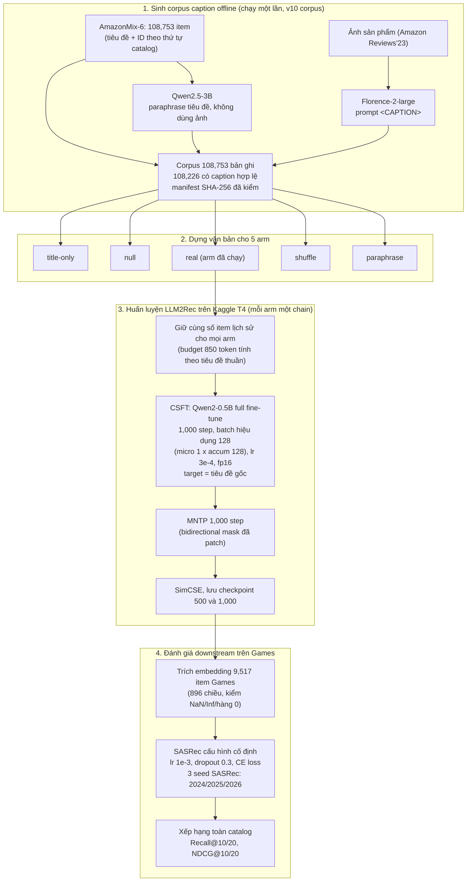

# Hướng v10 — Caption Augmentation cho LLM2Rec: giới thiệu phương pháp và kết quả hiện tại

> Tài liệu giới thiệu cho giáo viên hướng dẫn. Mọi con số là giá trị tuyệt đối (không dùng %), lấy trực tiếp từ artifact Kaggle đã tải về hoặc từ báo cáo đã audit; nguồn ghi ở cuối mỗi bảng.
> Trạng thái: **đang chạy, chưa có kết luận khoa học**. Mới có arm `real`, với **1 chain huấn luyện** (chạy 2 lần: v8 và v9); các arm đối chứng chưa chạy.

---

## 1. Ý tưởng trong một đoạn

LLM2Rec (He et al., 2025) biến một LLM nhỏ (`Qwen2-0.5B`) thành bộ sinh item embedding chỉ từ **tiêu đề sản phẩm**, qua 3 bước huấn luyện: CSFT (dự đoán tiêu đề item tiếp theo từ lịch sử), MNTP và SimCSE (gộp lại gọi là IEM, học embedding hai chiều). Embedding này được dùng làm item representation cho mô hình tuần tự SASRec.

Hướng v10 đặt câu hỏi: **nếu thêm mô tả ảnh sản phẩm (caption) vào văn bản của từng item trong lịch sử, embedding có tốt hơn không?** Ảnh không đưa trực tiếp vào mô hình; ta dùng Florence‑2 sinh caption **offline một lần**, rồi ghép `tiêu đề + caption` vào đầu vào văn bản. Mục tiêu (target) của CSFT vẫn giữ nguyên là tiêu đề gốc, nên mô hình chỉ được "đọc thêm", không bị đổi nhiệm vụ.

Để biết caption có ích **vì nội dung ảnh đúng** hay chỉ vì "thêm chữ", thiết kế có 5 arm đối chứng dùng chung một pipeline:

| Arm | Văn bản của item i | Kiểm tra điều gì |
|---|---|---|
| `title-only` | `T_i` | Comparator chính, cùng pipeline |
| `null` | `T_i + "unavailable"` | Hiệu ứng của việc thêm khuôn chữ cố định |
| `real` | `T_i + caption(ảnh của i)` | Can thiệp thật |
| `shuffle` | `T_i + caption(ảnh của item khác)` | Ảnh phải **đúng item** mới có ích? |
| `paraphrase` | `T_i + diễn giải lại T_i` (Qwen2.5‑3B, không nhìn ảnh) | Lợi ích đến từ ảnh hay chỉ từ "thêm chữ"? |

---

## 2. Kiến trúc phương pháp đã cài đặt

**Điểm kỹ thuật cần biết khi đọc kết quả:**

- Chạy trên 1 GPU T4 (16 GB), nên dùng profile "compatibility": fp16 thay bf16, SDPA thay FlashAttention‑2, CSFT 1,000 step thay vì 10,000 step của paper. Đây **không phải** reproduction đầy đủ cấu hình paper.
- CSFT một chain mất 19,853 giây (≈5.5 giờ GPU), VRAM đỉnh 13.07 GB.
- Mô hình Qwen2 trong IEM được patch để attention thật sự hai chiều; bước preflight kiểm tra token tương lai làm thay đổi hidden state (đạt ở cả checkpoint 500 và 1,000).

---

## 3. Bảng kết quả (Games, SASRec, full-catalog, cùng protocol aggregate của paper)

Mỗi dòng "v10" là trung bình của 3 seed SASRec trên **một** chain LLM2Rec.
- **v8**: chạy đầu tiên của arm `real`.
- **v9**: chạy lại sau khi sửa lỗi budget lịch sử token (bản sửa chỉ thay đổi đúng 1 item lịch sử trên 4,029,849 item).

### 3.1. So với các baseline trong paper LLM2Rec (Table 3) và bản tái lập của nhóm

| Mô hình | Recall@10 | NDCG@10 | Recall@20 | NDCG@20 |
|---|---:|---:|---:|---:|
| BERT (paper) | 0.0585 | 0.0311 | 0.0863 | 0.0381 |
| GTE (paper) | 0.0641 | 0.0349 | 0.0911 | 0.0418 |
| EasyRec (paper) | 0.0647 | 0.0357 | 0.0926 | 0.0428 |
| BLAIR (paper) | 0.0654 | 0.0361 | 0.0954 | 0.0437 |
| BGE (paper) | 0.0733 | 0.0410 | 0.1022 | 0.0483 |
| LLM2Vec (paper) | 0.0740 | 0.0407 | 0.1029 | 0.0480 |
| LLMEmb (paper) | 0.0813 | 0.0487 | 0.1085 | 0.0555 |
| **LLM2Rec (paper, full compute)** | **0.0865** | **0.0521** | **0.1157** | **0.0595** |
| LLM2Rec v0 — tái lập T4, ckpt‑500 | 0.0821 | 0.0498 | 0.1091 | 0.0566 |
| LLM2Rec v0 — tái lập T4, ckpt‑1000 | 0.0821 | 0.0504 | 0.1091 | 0.0572 |
| LLM2Rec text-only, IEM đã patch, ckpt‑500 | 0.0782 | 0.0464 | chưa ghi nhận | chưa ghi nhận |
| LLM2Rec text-only, IEM đã patch, ckpt‑1000 | 0.0794 | 0.0475 | chưa ghi nhận | chưa ghi nhận |
| **v10 real (v8), ckpt‑500** | **0.0824** | **0.0495** | **0.1092** | **0.0562** |
| **v10 real (v8), ckpt‑1000** | **0.0825** | **0.0487** | **0.1116** | **0.0560** |
| **v10 real (v9), ckpt‑500** | **0.0809** | **0.0477** | **0.1094** | **0.0549** |
| **v10 real (v9), ckpt‑1000** | **0.0708** | **0.0416** | **0.0965** | **0.0480** |

Nguồn: paper Table 3 (chép lại trong `README.md`, mục SOTA Landscape); v0 và text-only đã patch: `docs/reports/v0-v9-baseline-and-visual-fusion.md` §3.1–3.2, NDCG@20/Recall@20 của v0 ckpt‑500 lấy từ R2a recall-scope audit trong workspace nghiên cứu (không đưa vào repo này); v10: `research/caption_augmentation/results/v8/` và `research/caption_augmentation/results/v9/`, file `sasrec_results_step{500,1000}.txt`.

### 3.2. Chênh lệch tuyệt đối của arm real so với hai baseline nội bộ

Giá trị = `v10 real − baseline`, cùng checkpoint. Số dương nghĩa là real cao hơn.

| Checkpoint | So sánh | ΔRecall@10 | ΔNDCG@10 | ΔRecall@20 | ΔNDCG@20 |
|---|---|---:|---:|---:|---:|
| 500 | v8 − v0 | +0.00035 | −0.00026 | +0.00011 | −0.00032 |
| 500 | v9 − v0 | −0.00113 | −0.00203 | +0.00037 | −0.00166 |
| 1000 | v8 − v0 | +0.00043 | −0.00174 | +0.00252 | −0.00119 |
| 1000 | v9 − v0 | −0.01127 | −0.00885 | −0.01264 | −0.00920 |
| 500 | v8 − text đã patch | +0.00424 | +0.00313 | — | — |
| 500 | v9 − text đã patch | +0.00276 | +0.00135 | — | — |
| 1000 | v8 − text đã patch | +0.00309 | +0.00116 | — | — |
| 1000 | v9 − text đã patch | −0.00861 | −0.00595 | — | — |

Để so sánh: độ lệch chuẩn NDCG@10 giữa 3 seed SASRec **trong cùng một chain** đã là 0.00150–0.00374, tức ngang hoặc lớn hơn phần lớn các chênh lệch ở trên.

### 3.3. Chi tiết theo seed SASRec (NDCG@10)

| Chạy | Checkpoint | Seed 2024 | Seed 2025 | Seed 2026 | Trung bình | Độ lệch chuẩn |
|---|---|---:|---:|---:|---:|---:|
| v8 | 500 | 0.05132 | 0.04984 | 0.04733 | 0.04950 | 0.00165 |
| v8 | 1000 | 0.04450 | 0.05226 | 0.04923 | 0.04866 | 0.00319 |
| v9 | 500 | 0.04641 | 0.04982 | 0.04693 | 0.04772 | 0.00150 |
| v9 | 1000 | 0.03797 | 0.04672 | 0.03997 | 0.04155 | 0.00374 |

---

## 4. Đọc kết quả thế nào cho đúng

1. **Chưa có kết luận về hiệu quả của caption.** Hiện chỉ có arm `real`. Các arm `title-only`, `null`, `shuffle`, `paraphrase` chưa chạy, nên chưa tách được "ảnh đúng item" khỏi "thêm chữ".
2. **Chọn baseline nào.** v0 (0.0504) được huấn luyện **trước** khi patch bidirectional, còn v10 dùng IEM đã patch. Vì vậy baseline gần nhất là text-only đã patch (0.0464 / 0.0475). Baseline matched đúng nghĩa là arm `title-only` đi qua cùng runner v10, và arm này chưa có.
3. **So với paper:** chưa dòng v10 nào đạt mức LLM2Rec paper (NDCG@10 0.0521, Recall@10 0.0865). Tuy vậy mọi dòng v10 trừ v9 ckpt‑1000 vẫn cao hơn LLMEmb (0.0487 / 0.0813). Lưu ý các dòng của nhóm chạy với 1/10 số step CSFT trên T4.
4. **Biến động giữa hai lần chạy là vấn đề chính.** v8 và v9 gần như cùng dữ liệu (lệch 1 item) nhưng NDCG@10 ở ckpt‑1000 chênh 0.00711. Kiểm tra code cho thấy mọi stage (CSFT qua `Trainer`, MNTP, SimCSE) **đều đã cố định seed 42**. Nguồn biến động còn lại gần như chắc chắn là tính toán GPU không tất định (fp16, SDPA backward), khuếch đại qua 1,000 step chưa hội tụ. Đây là suy luận, chưa đo trực tiếp. Lỗi thật về seed nằm ở chỗ khác: cả thí nghiệm chỉ có **một chain seed**, trong khi protocol yêu cầu 3 chain end-to-end (2024/2025/2026). Ba "seed" hiện có chỉ là seed của SASRec.
5. **Chọn checkpoint.** Protocol quy định chọn ckpt‑500 hay ckpt‑1000 theo validation. Kết quả hiện chỉ lưu test, nên cả hai checkpoint được báo cáo song song, không chọn cái đẹp hơn.

---

## 5. Bước tiếp theo đề xuất

| Việc | Lý do | Chi phí ước tính |
|---|---|---|
| Truyền `chain_seed` 2024/2025/2026 vào CSFT, MNTP, SimCSE; ghi vào manifest | Đo được biến động giữa các chain đúng protocol | Không tốn GPU |
| Lưu metric validation, chọn checkpoint bằng validation | Tránh chọn checkpoint bằng tập test | Không tốn GPU |
| Chạy arm `title-only` qua cùng runner | Tạo comparator matched đầu tiên | ≈6.3 giờ GPU/chain + IEM (chưa đo) |
| Chạy 3 chain cho `real` và `title-only`, bootstrap cặp theo seed rồi theo user | Đây mới là gate khoa học đã đăng ký | ≈40 giờ GPU trở lên cho Games |

**Tiêu chí thành công đã đăng ký:** arm `real` hơn từng arm đối chứng ở NDCG@10, có khoảng tin cậy 95% nằm trên 0 và thắng ở cả 3/3 chain; Recall@10 không giảm quá ngưỡng đã định. Nếu không đạt, kết quả được báo cáo là âm tính hoặc chưa kết luận, không điều chỉnh sau khi xem test.

---

## 6. Nguồn dữ liệu

- Code cài đặt: `research/caption_augmentation/kaggle/{full_corpus_generation.ipynb,csft_caption.py,iem_caption.py,evaluate_caption.py}`; module dựng corpus/arm: `research/caption_augmentation/*.py`
- Artifact CSFT: `research/caption_augmentation/results/{v8,v9}/caption_csft_artifact.json`
- Artifact đánh giá: `research/caption_augmentation/results/{v8,v9}/games_evaluation_artifact.json`
- Thiết kế chi tiết và audit corpus: `docs/reports/v10-caption-augmentation-design.md`
- Protocol đóng băng: `research/caption_augmentation/experiment.json`
- Baseline nội bộ: `docs/reports/v0-v9-baseline-and-visual-fusion.md` §3
