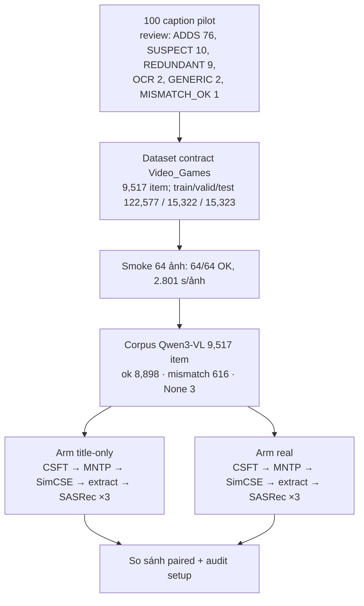

# Hướng v10 — Pilot paired Video_Games: caption Qwen3-VL so với title-only

> Tài liệu cho giáo viên hướng dẫn. Mọi số liệu lấy trực tiếp từ artifact Kaggle đã tải về; đường dẫn nguồn ghi ở mục 9.
> Trạng thái: **đã chạy xong, kết luận âm trong thiết kế này**. Mỗi arm có **1 chain LLM** × 3 seed SASRec, nên đây là pilot thăm dò một domain, không phải bằng chứng cho giao thức AmazonMix-6 đầy đủ.

---

## 1. Kết luận ngắn

Thêm caption ảnh do Qwen3-VL-4B sinh ra vào văn bản item **không cải thiện** gợi ý trên Video_Games; cả bốn metric đều giảm nhẹ (Recall@10 −6.5%, NDCG@10 −3.6%). Audit setup không tìm thấy lỗi cài đặt nào giải thích được kết quả này: caption đã thực sự đi vào mô hình và làm embedding item dịch về phía đặc điểm ngoại hình (màu, hình dạng), làm yếu tín hiệu "item được mua tiếp theo". Điểm chưa chắc chắn duy nhất là mỗi arm chỉ có một chain LLM, nên chưa đo được dao động giữa các lần train LLM.

---

## 2. Câu hỏi và thiết kế

**Câu hỏi.** Với cùng một pipeline LLM2Rec rút gọn chỉ trên Video_Games, thêm mô tả ảnh vào văn bản item có làm embedding tốt hơn cho SASRec không?

**Hai arm** dùng chung dữ liệu, chung seed, chung siêu tham số; chỉ khác văn bản của item:

| Arm | Văn bản của item i | Vai trò |
|---|---|---|
| `title-only` | `T_i` (title gốc) | Baseline — LLM2Rec rút gọn |
| `real` | `Title: T_i; Visual cues: <caption>` (cue ≤ 32 token) | Can thiệp |

Item không có caption dùng được (ảnh lỗi hoặc caption `mismatch`) **không bị bỏ** mà ghi `Visual cues: unavailable` (619 item, 6.5%).

**Đưa gì vào từng bước huấn luyện.** CSFT luôn là "đọc lịch sử → sinh title item kế tiếp"; loss chỉ tính trên target (phần input gán `labels = -100`, `llm2rec/dataset.py:103-116`), nên caption trong lịch sử chỉ là ngữ cảnh đọc thêm.

| | LLM2Rec gốc | Hướng caption cũ (v8/v9) | Pilot này — `title-only` | Pilot này — `real` |
|---|---|---|---|---|
| Dữ liệu CSFT | AmazonMix-6 (6 domain) | AmazonMix-6 | Video_Games (122,577 dòng train) | Video_Games |
| Item trong lịch sử CSFT | title | title + caption | title | `Title: …; Visual cues: …` |
| Target CSFT | title | title | title | title gốc |
| Số step CSFT | 10,000 | 1,000 | 1,000 (≈1 epoch) | 1,000 |
| Văn bản IEM (MNTP + SimCSE) | title AmazonMix-6 | title AmazonMix-6 | 9,517 title Games | 9,517 title + cue |
| Văn bản khi extract embedding | title | title | title | title + cue |

Khác biệt quan trọng so với v8/v9: pilot này đưa caption vào **cả ba chỗ** (lịch sử CSFT, IEM, extract), còn v8/v9 chỉ đưa vào lịch sử CSFT.

**Siêu tham số chung.** Qwen2-0.5B; CSFT lr 3e-4, batch 128 (micro 1), cutoff 1024, fp16, chain seed 2024. MNTP batch 8 × accum 4, dừng ở step 1000, max_seq 512. SimCSE batch 32, dừng ở step 1000, mean pooling, dropout 0.2. Extract bằng mean pooling hai chiều. SASRec: lr 1e-3, weight decay 1e-4, dropout 0.3, CE loss, seed 2024/2025/2026, metric trên tập test.

**Giao thức được người dùng chọn:** 1 chain LLM mỗi arm × 3 seed SASRec (22.8 GPU-h dự kiến), vì 6 chain đầy đủ (37.7 GPU-h) vượt cap 30 GPU-h.

---

## 3. Quy trình đã chạy

- **Review 100 caption:** do trợ lý kiểm tra bằng mắt theo ủy quyền của người dùng, không phải annotator độc lập; qua quality gate. Chỉ dòng 42 khác giữa nhãn AI nháp và nhãn review (ADDS → SUSPECT).
- **Ghép ID:** CSV split dùng ID 0-based theo một hoán vị khác với ID downstream 1-based; hai không gian được ghép qua ASIN (downstream ID = global ID − 66082 + 1), bijective 9,517/9,517.
- **Corpus:** kernel `trixuanle/llm2rec-qwen3vl-video-games-corpus-v1`; v1 dừng ở 6,299/9,517, v2 resume và COMPLETE; 19 shard có SHA-256 đã kiểm; ảnh: 9,514 decode được, 2 tải lỗi, 1 thiếu metadata.
- **Hai arm:** kernel `trixuanle/llm2rec-vg-paired-title-only-v1` (PASS ở v3) và `trixuanle/llm2rec-vg-paired-real-v1` (CSFT ở v3, IEM + đánh giá ở v4 sau resume; SHA checkpoint CSFT khớp `0ab4cbed…`).

---

## 4. Kết quả

**Từng seed SASRec (tập test):**

| Seed | Arm | Recall@10 | Recall@20 | NDCG@10 | NDCG@20 |
|---|---|---|---|---|---|
| 2024 | title-only | 0.0837 | 0.1103 | 0.0502 | 0.0568 |
| 2024 | real | 0.0775 | 0.1033 | 0.0482 | 0.0547 |
| 2025 | title-only | 0.0829 | 0.1094 | 0.0478 | 0.0544 |
| 2025 | real | 0.0741 | 0.0978 | 0.0437 | 0.0496 |
| 2026 | title-only | 0.0846 | 0.1110 | 0.0519 | 0.0585 |
| 2026 | real | 0.0834 | 0.1074 | 0.0525 | 0.0586 |

**Trung bình ± độ lệch chuẩn qua 3 seed, và chênh lệch paired:**

| Metric | title-only | real | Δ (real − title-only) | Seed real thắng |
|---|---|---|---|---|
| Recall@10 | 0.0838 ± 0.0008 | 0.0783 ± 0.0047 | −0.0054 (−6.5%) | 0/3 |
| Recall@20 | 0.1102 ± 0.0008 | 0.1028 ± 0.0048 | −0.0074 (−6.7%) | 0/3 |
| NDCG@10 | 0.0499 ± 0.0021 | 0.0482 ± 0.0044 | −0.0018 (−3.6%) | 1/3 |
| NDCG@20 | 0.0566 ± 0.0020 | 0.0543 ± 0.0045 | −0.0023 (−4.0%) | 1/3 |

Arm `real` còn dao động giữa các seed lớn hơn khoảng 6 lần trên Recall. Để tham chiếu, lần chạy v9 (caption chỉ ở lịch sử CSFT, pretrain AmazonMix-6) đạt Recall@10 0.0708 ± 0.0032 trên Games; baseline `title-only` của pilot này cao hơn, nên pipeline rút gọn không nằm trong chế độ hỏng.

---

## 5. Có phải do setup sai không?

Mọi nghi vấn đều được kiểm tra trên artifact và source đã pin:

| Nghi vấn | Kết quả | Bằng chứng |
|---|---|---|
| Ghép sai ID item | Không | 9,517/9,517 item ghép bijective qua ASIN lấy từ shard đã kiểm hash |
| Caption không vào dữ liệu train | Không | 581,106/581,106 item lịch sử CSFT của `real` có cue; 9,517/9,517 văn bản IEM có cue |
| Target CSFT bị dính caption | Không | Target là title gốc ở cả hai arm |
| Lịch sử hai arm khác nhau | Không | Cùng số item; 0 item bị cắt (581,106/581,106 giữ nguyên) |
| Văn bản bị cắt cụt | Không | Cue ≤ 32 token; giới hạn CSFT 1024, IEM/extract 512/400 token |
| Pooling lúc extract khác lúc train | Không | Cả hai dùng mean pooling (`utils/llm2vec_encoder.py:49`) |
| CSFT không hội tụ | Không | Loss trung bình theo 5 đoạn: title-only 2.055 → 0.787, real 2.035 → 0.777 |
| Resume làm hỏng checkpoint | Không | SHA checkpoint CSFT sau resume trùng bản gốc |
| Pipeline yếu bất thường | Không | title-only Recall@10 0.0838 > v9 0.0708 |

---

## 6. Caption làm hại ở đâu

Đo trực tiếp trên embedding item, không qua SASRec (107,119 cặp "item trước → item kế tiếp" trong train, so với cặp ngẫu nhiên):

| Chỉ số | title-only | real |
|---|---|---|
| AUC phân biệt cặp kế tiếp với cặp ngẫu nhiên | 0.620 | 0.588 |
| AUC chỉ trên cặp mà cả hai item có caption thật | 0.620 | 0.588 |
| Hit@10 zero-shot của item kế tiếp | 2.43% | 2.05% |
| Rank trung vị của item kế tiếp | 3,052 | 3,630 |
| Độ hút giữa item cùng màu (cos cùng màu − khác màu) | 0.042 | 0.059 |
| Effective rank của không gian embedding | 287 | 470 |
| Trùng lặp top-10 hàng xóm giữa hai arm | — | 20% |

Đọc kết quả: embedding không bị sụp (effective rank còn tăng), nhưng không gian bị sắp xếp lại theo ngoại hình — item cùng màu bị kéo lại gần nhau hơn khoảng 41%, và chỉ 20% hàng xóm gần nhất giữ nguyên. Tín hiệu hành vi mua giảm ngay cả khi loại trừ 619 item `unavailable`, nên nguyên nhân là chính caption chứ không phải item thiếu ảnh.

Giải thích hợp lý nhất *(suy luận, chưa kiểm chứng riêng)*: hành vi mua Video_Games xoay quanh hệ máy và dòng game — thông tin đã có trong title — còn caption mô tả màu sắc, hình dạng, phụ kiện, vốn ít liên quan đến việc người dùng mua gì tiếp theo.

---

## 7. Sự cố vận hành và ngân sách GPU

| Lần chạy | Kết quả | Nguyên nhân / xử lý |
|---|---|---|
| Arm v1 (cả hai) | ERROR sau ~3 phút | File arm của corpus thiếu `asin`, một title trùng chặn fallback; sửa bằng cách lấy ASIN từ shard đã kiểm hash |
| Arm v2 (cả hai) | Bị Kaggle cancel cùng lúc sau ~2h10 | Không do trợ lý; log không có lỗi; bản bị cancel không được mount làm `kernel_sources` nên không resume được |
| title-only v3 | PASS | CSFT 16,435 s, IEM 2,085 s, đánh giá 1,017 s |
| real v3 | CSFT xong, dừng trước IEM | Guard deadline 6 giờ; CSFT 18,810 s |
| real v4 | PASS | Resume CSFT; IEM 2,655 s, đánh giá 1,145 s; thêm guard `RESUME_REQUIRED` để không lặng lẽ train lại |

**GPU:** kernel khai báo `NvidiaL4`, nhưng artifact của hai arm ghi `cuda_device: Tesla T4`; thiết bị của smoke và corpus không được ghi lại.

| Hạng mục | GPU-h |
|---|---|
| Trước pilot (corpus T4 v1–v4 + smoke) | 6.28 |
| Corpus Video_Games v1 + v2 | 8.23 |
| Arm v1 lỗi (2 kernel) | 0.10 |
| Arm v2 bị cancel (2 kernel) | 4.33 |
| real v3 | 5.27 |
| title-only v3 | 5.47 |
| real v4 | 1.08 |
| **Tổng** | **30.77** |

Vượt cap 30 GPU-h khoảng 0.8 h; phần vượt đã được người dùng duyệt trước khi chạy real v4.

---

## 8. Giới hạn và hướng tiếp theo

**Giới hạn.**
- 1 chain LLM mỗi arm: độ lệch chuẩn trên chỉ phản ánh seed SASRec, không phải seed LLM. Chênh lệch 3–7% vẫn có thể nằm trong dao động giữa các chain.
- Hai arm khác nhau cả về nội dung caption lẫn định dạng (`Title: …; Visual cues: …` so với title trần), nên không tách được hiệu ứng định dạng.
- Chỉ một domain, pretrain rút gọn 1,000 step; không suy rộng cho AmazonMix-6.
- Review 100 caption là audit của trợ lý theo ủy quyền, không phải nhãn người độc lập.

**Hướng tiếp theo (cần người quyết định):**
1. Chấp nhận kết quả âm và đóng hướng caption ngoại hình — không tốn GPU.
2. Thêm 1 chain mỗi arm để đo dao động giữa các chain (~11 GPU-h, cần cấp thêm ngân sách) — chỉ khi cần đưa kết luận vào luận văn.
3. Giả thuyết mới: chỉ đưa caption vào lịch sử CSFT (giống v8/v9), giữ title ở IEM và extract, bỏ cue `unavailable`, cùng định dạng `Title:` cho hai arm — tách được caption hại ở bước CSFT hay bước tạo embedding.

---

## 9. Nguồn

Thư mục gốc: `research/caption_augmentation/results/video_games_pilot/`

- `video_games_dataset_contract.json`, `budget_projection.json`, `l4_smoke/`
- `corpus_v1/` — summary, shard manifest, 19 shard, `video_games_paired_arms.jsonl`
- `title-only_arm_v3/video_games_paired_title-only_artifact.json`, `sasrec_title-only_results.txt`
- `real_arm_v3/` (CSFT) và `real_arm_v4/video_games_paired_real_artifact.json`, `sasrec_real_results.txt`
- `paired_comparison.json` — bảng mục 4
- `setup_audit.json` — mục 5 và 6
- SHA-256 embedding: title-only `270ec231…`, real `09b7feff…` (file `.npy` không commit vì dung lượng)

Code: `research/caption_augmentation/video_games_pilot.py`, `kaggle/video_games_corpus/`, `kaggle/video_games_paired_arm.py` (template sinh `kaggle/video_games_paired_{title-only,real}/runner.py`). Kế hoạch: `plans/260929-0014-video-games-qwen-paired-pilot/`.
